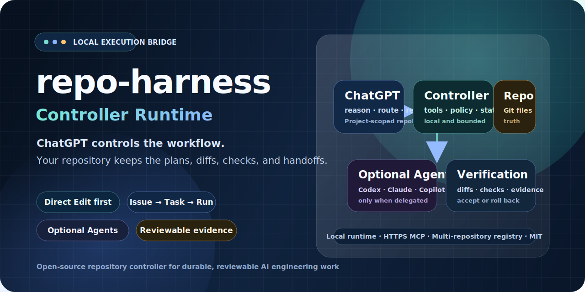

# repo-harness Controller Runtime

<p align="center">
  
</p>

<p align="center">
  <strong>ChatGPT as the controller. Your repository as the source of truth.</strong>
</p>

<p align="center">
  <a href="README.en.md">English</a> · <a href="README.md">简体中文</a>
</p>

`repo-harness Controller Runtime` is a local-first repository execution bridge for ChatGPT. It gives ChatGPT bounded tools to inspect repositories, manage Issues and Tasks, apply Direct Edits, run named checks, review diffs, and optionally delegate implementation to coding agents.

The project is designed for real repositories rather than disposable chat sessions: plans, task state, execution evidence, checks, and handoffs remain attached to the repository and can be resumed later. The current runtime uses a Thin Gateway, durable Jobs, a Global Scheduler, one Repo Actor per repository, isolated Workers, and an Evidence Plane.

New users should enter through this path:

1. [Public usage guide](docs/public-usage-guide.md)
2. [Install and start](docs/tutorials/01-install-and-start.md)
3. [Connect ChatGPT](docs/tutorials/02-connect-chatgpt.md)
4. [Complete the first repository task](docs/tutorials/03-first-repository-task.md)

> Current package version: `1.4.0-rc.1` (`next` dist-tag on npm)
>
> Controller tool surface: `controller-chatgpt-bridge-v8`, schema `10`, surface version `8`

The current public distribution is still an RC. This README describes the current implementation and install path; it does not imply that stable `1.4.0` has already shipped.

## Why this project

- **ChatGPT controls the workflow.** ChatGPT reads, reasons, selects an execution mode, reviews changes, and decides what to do next.
- **Direct Edit first.** Small, known changes use bounded edit sessions with SHA protection, persisted diffs, savepoints, checks, and rollback.
- **Agents are optional workers.** Codex, Claude, or GitHub Copilot can be delegated larger implementation work, but they are not required for every change.
- **Repository state survives conversations.** Issues, Tasks, Runs, verification evidence, and handoffs are file-backed.
- **Multiple repositories are explicit.** Each registered repository receives a stable `repoId`; ambiguous multi-repository operations must name the target repository.
- **Local runtime, public HTTPS endpoint.** The MCP service stays on loopback; use Tailscale Funnel or Cloudflare named tunnel for a stable public HTTPS `/mcp` endpoint instead of temporary tunnel URLs.

## What it includes

| Capability | Description |
| --- | --- |
| Repository registry | Register one or more Git checkouts and address them by stable `repoId` and `checkoutId`. |
| ChatGPT MCP controller | Repository inspection, Issues/Tasks, Direct Edit, verification, Git, GitHub sync, and execution tools. |
| Direct Edit transactions | Multi-revision patches, bounded paths and size, SHA preconditions, savepoints, diff review, checks, and rollback. |
| Issue → Task → Run workflow | Durable dependency-aware work planning with review and verification gates. |
| Local Controller UI | A localhost-only execution-assistant console with Command Center, Approvals and Decisions, Current Work, Capabilities / Plugins, Models / Tools, System Status, Repositories, and Advanced Diagnostics. |
| Bounded results and evidence | Long-running work lands in durable Jobs and Runs first; MCP and the UI return summaries and bounded previews by default, then deeper evidence or artifacts on demand. |
| Runtime control plane | Thin Gateway, Global Scheduler, per-repository Actor, durable Execution Jobs, Claims, Leases, fencing, and isolated Workers. |
| Automation governance | Bounded Schedule/Decision/Occurrence workflows, Candidate Findings, Portfolio DAG/Saga, and release gates. |
| Runtime isolation | Controller state is stored outside the public source tree and linked only where required at runtime. |
| Public release tooling | Allowlisted export, path and secret scanning, release-surface checks, and package verification. |

## Quick start

### 1. Prerequisites and platform choice

- Git
- Node.js 20.10 or newer
- npm or Bun 1.0+; Bun is recommended for development
- macOS and modern Linux are supported; use WSL2 for the complete Windows workflow
- native Windows PowerShell is a preview path for installation, doctor, repository registration/inspection, and portable controller operations

See [Platform Support](docs/operations/platform-support.md), [Features and Setup Levels](docs/operations/features.md), and the complete [installation tutorial](docs/tutorials/01-install-and-start.md).

### 2. Install or run from source

```bash
npm install -g @moretea-labs/repo-harness-controller@next
# or: bun add -g @moretea-labs/repo-harness-controller@next
repo-harness install --no-cli
repo-harness doctor
```

The npm package is `@moretea-labs/repo-harness-controller`; it still installs the `repo-harness` and `repo-harness-hook` CLI commands. Release candidates use the `next` tag and do not claim the stable `latest` tag.

From source:

```bash
git clone https://github.com/moretea-labs/repo-harness-controller-runtime.git
cd repo-harness-controller-runtime
bun install
bun run src/cli/index.ts doctor
```

### 3. Adopt an existing repository

```bash
repo-harness adopt --repo /path/to/your-project --dry-run
repo-harness adopt --repo /path/to/your-project
```

When running directly from this source checkout, replace `repo-harness` with:

```bash
bun run src/cli/index.ts
```

### 4. Register the repository

```bash
repo-harness repo register /path/to/your-project --name my-project --json
repo-harness repo list --json
```

Keep the returned `repoId`. It is the stable execution identity used by ChatGPT tools.

### 5. Start the ChatGPT Controller endpoint

Register the repository and generate the ChatGPT MCP config:

```bash
repo-harness repo register /path/to/your-project
repo-harness mcp setup chatgpt --repo /path/to/your-project
```

By default, MCP only listens on loopback:

```text
http://127.0.0.1:8765/mcp
```

ChatGPT needs a public HTTPS URL ending in `/mcp`. Recommended options:

1. **Tailscale Funnel**: no custom domain or DNS; best for personal long-running use.
2. **Cloudflare named tunnel + your own domain**: best for standard long-running deployments.
3. **ngrok / Cloudflare quick tunnel**: suitable for temporary testing, not long-running ChatGPT Project connectors.

Tailscale Funnel example:

```bash
# First-time setup
brew install --cask tailscale
tailscale up

# Publish local MCP through HTTPS Funnel
tailscale funnel --bg 8765
tailscale funnel status
```

If the output looks like this:

```text
https://your-machine.your-tailnet.ts.net (Funnel on)
|-- / proxy http://127.0.0.1:8765
```

use this ChatGPT Connector URL:

```text
https://your-machine.your-tailnet.ts.net/mcp
```

Then start repo-harness with the same endpoint:

```bash
repo-harness mcp keepalive --repo /path/to/your-project --profile controller \
  --enable-dev-runner --dev-runner-agents codex,claude \
  --tunnel tailscale \
  --public-endpoint https://your-machine.your-tailnet.ts.net/mcp
```

### 6. One-command local lifecycle on macOS

From the source checkout, use the unified lifecycle wrapper to start, stop, inspect, restart, and read logs for the detached Controller stack:

```bash
bun run controller:start
bun run controller:status
bun run controller:logs
bun run controller:restart
bun run controller:stop
```

The same workflow is available without `package.json` scripts:

```bash
bash scripts/controller-runtime.sh start --repo .
bash scripts/controller-runtime.sh status --repo .
```

`start` performs bounded preflight checks for Bun, repository root resolution, package version, tracked PID state, MCP and Local Controller ports, controller home, and detached repo-harness orphan processes before launching the daemon, MCP Gateway, and Local Bridge. Logs default to `.ai/local/logs/repo-harness-controller.log`.

Controller Home is primary for MCP service config, authentication, and runtime state, including `controllerHome/mcp/mcp.local.json`, `mcp.tokens.json`, `mcp.oauth.json`, `mcp.oauth-tokens.json`, and `mcp.runtime.json`. The matching repo-local `.repo-harness/mcp.local.json`, `.repo-harness/mcp.tokens.json`, `.repo-harness/mcp.oauth.json`, `.repo-harness/mcp.oauth-tokens.json`, and `.repo-harness/mcp.runtime.json` files are legacy fallback only; repository-scoped `.repo-harness/mcp.policy.json` still narrows repository access. See [MCP tool exposure](docs/operations/mcp-tool-exposure.md).

## Connect ChatGPT

Start with [Tutorial 2: Connect ChatGPT](docs/tutorials/02-connect-chatgpt.md). After connecting, call `rh_status`, then use `rh_context` for the selected repository. The default `core` toolset contains `rh_status`, `rh_inbox`, `rh_context`, `rh_work`, plus `repository_list`, `repository_get`, `repository_register`, `repository_latest_source_diagnose`, and `repository_bootstrap_local_project`; use `advanced` for operator diagnostics and `full` only for compatibility.

If multiple repositories are registered, keep `repoId` and `checkoutId` explicit. The controller is a global service, but repository writes still route through repository- and checkout-scoped identities. The public MCP endpoint is distinct from the localhost-only Local Controller UI at `127.0.0.1:8766`.

See the [documentation hub](docs/README.md), or switch to [README.md](README.md) for Simplified Chinese.

## Make one repository the default in a ChatGPT Project

Yes. Put the stable repository identity in the ChatGPT Project instructions so every conversation in that Project starts with the same routing rule:

```text
Use repo-harness for repository work.
Default repoId: <repo-id returned by repo-harness repo register>
Default checkoutId: <checkout-id returned by repo-harness repo register>

Always pass this repoId and checkoutId to repo-harness tools unless I explicitly select another repository.
Start repository work with rh_status and rh_context.
Use rh_work for bounded changes. Delegate to an Agent only when the work genuinely requires one.
```

Project instructions are a durable conversation default, not a server-side authorization boundary. The controller still requires an explicit `repoId` when multiple repositories are enabled. This is intentional protection against changing the wrong repository.

## Documentation

- [Public documentation hub](docs/README.md)
- [English tutorials](docs/tutorials/README.md)
- [中文快速教程](docs/tutorials/README.zh-CN.md)
- [Current architecture authority](docs/architecture/index.md)

Historical designs and research records are explicitly non-authoritative. A new user can install, connect, and complete a first task without reading them.

## Security model

- Keep the MCP runtime bound to `127.0.0.1`; publish it only through a controlled HTTPS tunnel or reverse proxy.
- Do not expose the local Controller UI (`127.0.0.1:8766`) publicly.
- Prefer ChatGPT connector authentication and conservative app permissions for write-capable tools.
- Use named checks instead of arbitrary verification commands.
- Do not assume a `502`, reconnect, or truncated large response means a write failed; confirm the actual state from the Job, Run, or evidence summary first.
- Review diffs and verification evidence before accepting a Task or finalizing a Direct Edit.
- Never commit Controller runtime state, local logs, credentials, tokens, worktrees, or edit-session data.

## Upstream and license

This project is a substantially modified derivative of [AncientTwo/repo-harness](https://github.com/AncientTwo/repo-harness). The original project established the repo-local workflow foundation; this repository adds and adapts the ChatGPT Controller, repository registry, runtime-storage isolation, Direct Edit execution, governance, verification, local execution bridge, and public-release tooling.

Distributed under the MIT License. See [LICENSE](LICENSE) and [NOTICE](NOTICE). Reference to the upstream project does not imply endorsement of this derivative work.

## Status

This repository is being prepared as an independently publishable open-source distribution. Before a release, run:

```bash
bun run check:release-surface
bun run check:public-export
bun run check:type
bun run check:runtime-architecture
bun run check:mcp-compatibility
bun run smoke:runtime-recovery
bun run smoke:schedule-engine
bun run smoke:runtime-control-plane
bun run smoke:mcp-http-runtime
bun run test
```
