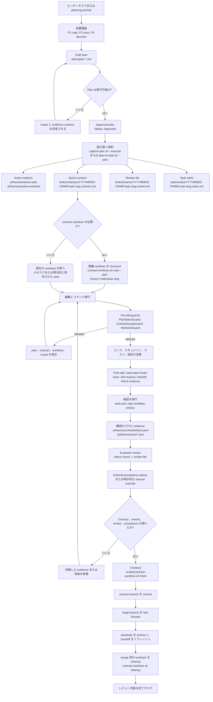
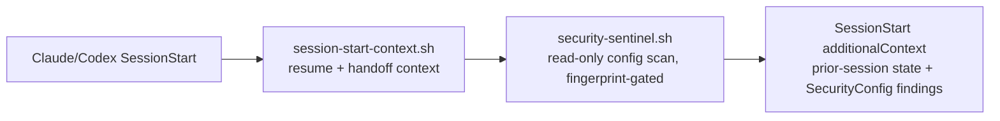
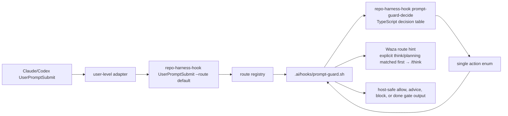

# repo-harness

<p align="center">
  
</p>

`repo-harness` は、Claude/Codex のコーディング session を、繰り返し使える
repo-local workflow に変えます。CLI と skill/runtime hooks によって、context、plan、
handoff、check、review evidence をプロジェクト内のファイルへ書き戻し、次の agent session が
chat memory ではなくファイルから続きに入れるようにします。

主な用途:

- 既存リポジトリへ tasks-first agent contract を導入する
- Claude と Codex を同じ plan、check、handoff、context boundary に揃える
- CodeGraph と段階的な context loading により、構造を再発見するための token 消費を減らす

Agent に完全な PRD または Sprint を渡せば、あとは review and `next` だけで進めるか、
`/goal` を開始して AFK できます。

[English](README.md) | [简体中文](README.zh-CN.md) | [日本語](README.ja.md) | [Français](README.fr.md) | [Español](README.es.md)

リポジトリ：`https://github.com/Ancienttwo/repo-harness`

## なぜ repo-harness を使うのか

- **セッションの状態はファイルに残り、チャット履歴には残らない。** 別々の agent
  セッション（Claude、Codex、今のものも後のものも）は、チャットスレッドではなくリポジトリを通じて
  同期を保ちます。新しいセッションが始まると `.ai/hooks/session-start-context.sh` が前回セッションの
  resume packet（`.ai/harness/handoff/resume.md`、`tasks/current.md`）を注入し、セッション終了時と
  各編集後には `finalize-handoff.sh` と `post-edit-guard.sh` が次の handoff を書き戻します。タスクは
  途中で中断でき、次のセッションは正確な次の一手・ブロッカー・変更ファイルをそのまま引き継ぐので、
  状況を推測し直す必要がありません。
- **設計上 token を節約する。** セッションごとにリポジトリを grep+read で再スキャンするループに頼る
  代わりに、harness は事前構築された CodeGraph index を使って構造的なクエリ（誰が呼ぶ・何を呼ぶ・
  どこで定義されているか）を行い、さらに `.ai/context/context-map.json` と `capabilities.json` を使って
  段階的な context 読み込みを行います。小さく安定した root context（約 12KB）に、対応するファイルを
  触ったときだけ読み込まれる capability ブロックが加わる構成です。agent は構造を把握し直すために数千
  token を費やすのではなく、1KB の capability contract を読むか index に問い合わせます。

導入後のリポジトリで意識する surface は小さく保たれます。

| Surface | 目的 |
| --- | --- |
| `docs/spec.md` と `docs/reference-configs/` | すべての agent session が読める共有標準と安定した product intent。 |
| `plans/`, `plans/prds/`, `plans/sprints/` | 実装前に固める decision-complete work packages。 |
| `tasks/contracts/`, `tasks/reviews/`, `.ai/harness/checks/` | 作業完了を証明する scope、verification、review evidence。 |
| `.ai/harness/handoff/` と `tasks/current.md` | chat memory ではなく workflow artifacts から派生する session journal と resumable status。 |

## Human Review Path

まず `tasks/reviews/<task>.review.md` を読みます。`## Human Review Card` は
1 画面の意思決定面で、verdict、change type、想定/実際の変更ファイル、通過した
コマンド、external acceptance、残余リスク、reviewer action、rollback を載せます。
続いて active contract、`.ai/harness/checks/latest.json` の latest trace、変更
ファイルを確認します。review が pass を推奨し、card の verdict が pass で、
external acceptance が pass・`not_required`・明示的な manual override のいずれ
かのときだけ accept します。

## Agent Tracking Path

Agent は派生サマリーより先に source artifacts を読みます。

| Agent reads first | Human reviews first |
| --- | --- |
| 現在のユーザー prompt と参照ファイル | `tasks/reviews/<task>.review.md` の Human Review Card |
| `AGENTS.md` / `CLAUDE.md` | 変更ファイルと diff |
| `.ai/harness/active-plan` の active plan | active contract の allowed paths と exit criteria |
| `tasks/contracts/` の active contract | `.ai/harness/checks/latest.json` と run trace |
| `.ai/harness/handoff/` の latest handoff | 残余リスクと rollback |

`tasks/current.md` は orientation snapshot にすぎません。active plan、contract、
review、checks、handoff と食い違う場合は、source artifacts を優先します。

## What's New

リリースノートは [`docs/CHANGELOG.md`](docs/CHANGELOG.md) にあります。現在の
ラインは `0.8.0` です。

## 仕組み

設計は 3 層に分かれます。

1. **ソースパッケージ層**：本リポジトリが CLI、CLI-backed command facades、templates、hook assets、
   workflow contract、tests、release gate を所有します。
2. **対象リポジトリ contract 層**：`repo-harness adopt` または migration が、`docs/spec.md`、
   `plans/`、`tasks/`、`.ai/context/`、`.ai/harness/`、helper scripts、`.ai/hooks/` といった
   repo-local ファイルを書き込みます。
3. **Host adapter 層**：user-level の `~/.claude/settings.json` と `~/.codex/hooks.json` が
   Claude/Codex の events を `repo-harness-hook` へ route します。hook entrypoint は opt-in して
   いないリポジトリでは静かに終了し、`.ai/harness/workflow-contract.json` が存在する場合にのみ、
   現在のリポジトリの `.ai/hooks/*` スクリプトへ dispatch します。

`UserPromptSubmit` については、公開 adapter contract は引き続き
`repo-harness-hook UserPromptSubmit --route default` のままです。CLI の route registry が、この route を
`.ai/hooks/prompt-guard.sh` へ dispatch します。shell hook は引き続き、host JSON の解析、workflow
ファイルの読み取り、plan capture の副作用、quality gate のレンダリング、host-safe な stdout/stderr を
担う repo-local adapter です。prompt intent と workflow state の判断は、`repo-harness-hook
prompt-guard-decide` の背後にある TypeScript の decision engine が担い、明示的な decision table から
1 つの action enum を返します。この分離により、host の設定は安定したまま、最も壊れやすい
classifier/state-machine 層を shell の条件分岐から外へ出せます。

中核となる不変条件は、持続的な真実がチャットスレッドではなくリポジトリに存在することです。Hooks は
あくまで加速装置と guardrail であり、authority は plan、contract、review、checks、handoff といった
ファイルベースの成果物にあります。

## 任務 Workflow：Plan から Closeout まで

下の図は、対象リポジトリに harness がすでにインストールされている前提です。単一タスクの通常の閉ループ
を示しています。まず plan を形成し、sprint contract へ投射し、必要なら隔離された worktree を checkout し、
hooks の保護下で実装し、検証・review・external acceptance を経て、最後に closeout します。



## 長期プロダクト Loop

Greenfield と Brownfield の作業では、Codex に実行 loop を任せる前に、
discovery と engineering-plan judgment を Claude-Fable 側で前倒しします。

1. Claude-Fable で、product discovery には gstack `office-hours` を使い、
   engineering plan review には `plan-eng-review` を使います。出力は、product
   intent、architecture、risks、evidence contract を固定する development
   documents にします。
2. それらの documents を `plans/prds/` 配下の PRD Sprint に変換し、
   各 execution slice に ordered backlog と detailed sub-plans を持たせます。
3. Codex Goal を作成し、その sprint file を指します。repo-harness はその後、
   各 sprint item を通常の plan -> contract -> worktree -> verification flow
   へ投射できます。

この handoff により、長期 loop は精密になります。Claude-Fable が広い前置判断を担い、
PRD Sprint が durable source of truth となり、Codex Goal mode は元の chat を再解釈する
のではなく、具体的な sprint に対して resume します。

## 最初の 5 分

実際のリポジトリがこの workflow を導入するのに適しているかを評価する、最速の経路です。

前提条件：Git working tree、`bash`、`bun`（後続の検証と template assembly に使用）。
`jq` は任意。`--dry-run` のときは導入を推奨し、settings merge を適用するときにより有用です。

### CLI をインストールする

既定の経路では Node.js は不要です。installer は Bun を runtime として使います。
Bun が見つからない場合は、先に Bun をインストールしてから `repo-harness` CLI をインストールします。

```bash
# macOS / Linux
curl -fsSL https://raw.githubusercontent.com/Ancienttwo/repo-harness/main/install.sh | sh

# Windows (PowerShell)
irm https://raw.githubusercontent.com/Ancienttwo/repo-harness/main/install.ps1 | iex
```

<details>
<summary>Bun がすでにある場合は Bun を優先し、npx を fallback として使えます</summary>

```bash
# Bun（推奨）
bun add -g repo-harness
repo-harness install

# npx fallback。CLI runtime は Bun なので、Bun が PATH 上に必要です。
npx -y repo-harness install
```

</details>

### host runtime を bootstrap する

```bash
repo-harness install
```

`repo-harness install` は global bootstrap、`repo-harness update` は
user-level refresh、`repo-harness adopt` は repo-local refresh です。`repo-harness install` は CLI、user-level hook adapters、Waza、Mermaid、
brain root、CodeGraph MCP を設定し、退役した `scripts/setup-plugins.sh` の Claude plugin path は使いません。

package 本体を編集する maintainer はソースの checkout が必要です
—— [Maintainer Reference](#maintainer-reference) を参照してください。

### ここから始める

既存リポジトリでは repo root から実行します。

```bash
repo-harness adopt --dry-run
```

dry-run のレポートが正しいことを確認してから適用します。

```bash
repo-harness adopt
```

新しいプロジェクトやモジュールには支線 command `repo-harness-scaffold` を使います。既存リポジトリには
`repo-harness adopt` を使います。これは harness をインストールまたはリフレッシュするもので、アプリケーション
スタックは作成しません。

### 成功した状態

コマンドの最後には `=== Migration Report ===` が出力され、次の内容を含むはずです。

- `Project hooks synced from:`：生成された hook 行動がどこ由来かを示す
- `Host hook config target: user-level ~/.claude/settings.json and ~/.codex/hooks.json`：adapter 層がどこにあるか
- `Host hook adapters are user-level:`：global adapters のインストールを促し、`~/.codex/hooks.json` を信頼するよう注意する
- `Workflow migration:`：repo-local harness surfaces の作成またはリフレッシュ計画
- `Helper runtime:`：適用後に得られる操作ツールチェーン
- `--- External Tooling ---`：gstack/Waza/gbrain の route と advisory なインストール/更新のヒント

### 続けて実行する 2 つのコマンド

```bash
bash scripts/check-task-workflow.sh --strict
bun test
```

dry-run の出力がおかしい場合は、ここで一旦止め、
[`docs/reference-configs/hook-operations.md`](docs/reference-configs/hook-operations.md) を読んでください。

## MCP Connector Quickstart

オプションの sidecar として、`repo-harness mcp` は workflow artifacts だけを MCP
クライアントへ公開します。ChatGPT は状態を読み、アイデアを PRD、checklist Sprint、
Codex goal handoff へと進める planner/reviewer として働きます。source-code への
書き込み権限、任意の shell 実行、デフォルトの Codex runner はありません。Codex が
実行者のままです。

この sidecar は、上記「最初の 5 分」で CLI が既にインストール済みであることを
前提とします。ChatGPT に実際のリポジトリ状態へ対してプランニングさせ、生成された
file-backed Sprint を Codex に実行させたいときに使います。

```bash
repo-harness mcp setup chatgpt --repo .
repo-harness mcp serve --repo . --transport http --host 127.0.0.1 --port 8765 --profile planner
```

このローカル server を HTTPS tunnel 経由で公開し、`/mcp` URL で ChatGPT
Connector を作成します。生成されるガイドの書き出し先は次のとおりです。

```text
docs/repo-harness-chatgpt-mcp-setup.md
```

human workflow は次のとおりです。

1. ChatGPT が MCP 経由で repo-harness の workflow ファイルを読む。
2. ChatGPT が `write_prd_from_idea` で PRD を書く。
3. ChatGPT が `write_checklist_sprint` で checklist Sprint を書く。
4. ChatGPT が `prepare_codex_goal_from_sprint` で `.ai/harness/handoff/codex-goal.md` を準備する。
5. Codex が host-native `/goal` prompt を実行し、完了した Sprint phase を順に stage する。

最後の handoff ステップのローカルなフォールバック：

```bash
repo-harness mcp prepare-goal --repo . --prd plans/prds/<feature>.prd.md --sprint plans/sprints/<feature>.sprint.md
```

agent 向けの Skill のインストール先は次のとおりです。

```text
.agents/skills/repo-harness-chatgpt-bridge/SKILL.md
```

この Skill は、ChatGPT に source-code への書き込みや shell 実行を与えることなく、
ChatGPT が生成した PRD/Sprint/Goal artifacts を Codex がどう消費するかを伝えます。

Dev Mode は MCP 経由でローカル agent 実行を opt-in できます。デフォルトでは
無効です。ユーザーが `orchestrator` profile と dev runner 設定を有効にすると、
ChatGPT は `run_agent_goal` を呼べます。これは `.ai/harness/handoff/codex-goal.md`
だけを読み、`codex exec` や `claude -p` などの許可されたローカル CLI を通じて
固定された handoff を実行します。

```bash
repo-harness mcp serve --repo . --transport http --profile orchestrator --enable-dev-runner --dev-runner-agents codex
```

この設定はローカルの Developer Mode 専用です。タイムアウト上限があり、監査され、
任意の shell ではありません。

## Hook Authority Map

- `.ai/hooks/` が、最初に編集すべき唯一の shared hook implementation です。
- `~/.claude/settings.json` は user-level の Claude adapter で、opt-in したリポジトリへ dispatch します。
- `~/.codex/hooks.json` は user-level の Codex adapter で、同じ runner へ dispatch します。
- Repo-local の `.claude/settings.json` と `.codex/hooks.json` の hook adapters は legacy なプロジェクトレベル設定であり、migration 時に退役させるべきです。
- Codex は Settings で `~/.codex/hooks.json` を信頼済みにしないと、hooks は実行されません。
- デバッグの順序：user-level adapter config -> `repo-harness-hook` または fallback の `repo-harness hook` -> route registry -> `.ai/hooks/*`。


The installed adapter owns eight managed hook routes. The route tuple
`event + routeId + matcher` is the stable contract; script names are the current
implementation under `assets/hooks/` or a repo-pinned `.ai/hooks/` copy.

| Route | Matcher | Scripts | Function |
| --- | --- | --- | --- |
| `SessionStart.default` | all sessions | `session-start-context.sh`, `security-sentinel.sh` | Injects prior handoff, sprint status, and read-only config-security findings before work starts. |
| `PreToolUse.edit` | `Edit|Write` | `worktree-guard.sh`, `pre-edit-guard.sh` | Enforces worktree policy and plan/contract readiness before implementation edits. |
| `PreToolUse.subagent` | `Task|Agent|SendUserMessage` | `subagent-return-channel-guard.sh` | Keeps delegated work returning through the parent session instead of leaking completion claims. |
| `PostToolUse.edit` | `Edit|Write` | `post-edit-guard.sh` | Records edit traces, refreshes handoff/task status, and queues architecture drift when controlled files change. |
| `PostToolUse.bash` | `Bash` | `post-bash.sh` | Observes command results and captures verification evidence without replacing the command runner. |
| `PostToolUse.always` | all tools | `post-tool-observer.sh` | Provides low-noise always-on trace and runtime observation; stale pinned copies soft-skip with a refresh hint. |
| `UserPromptSubmit.default` | all prompts | `prompt-guard.sh` | Classifies prompt intent, routes planning/check/hunt hints, and renders host-safe workflow guidance. |
| `Stop.default` | session stop | `stop-orchestrator.sh` | Finalizes handoff and guards against ending with unresolved draft-plan or completion evidence gaps. |

`SessionStart` は作業開始前に 2 つの script を順番に実行します。



Prompt guard には内部ステップが 1 つ増えます。



shell 層は引き続きファイルシステムの authority と副作用を所有します。TypeScript は classifier と
`intent x plan state` の decision table だけを所有します。

## Hook Failure Playbook

hook がブロックしたときは、まず terminal の構造化された出力を見ます。中核となるフィールドは
`guard`、`reason`、`fix`、`failure_class`、`run_id` です。

- Failure log：`.ai/harness/failures/latest.jsonl`
- Trace log：`.claude/.trace.jsonl`
- 詳細ガイド：[`docs/reference-configs/hook-operations.md`](docs/reference-configs/hook-operations.md)

よくある guards：

- `PlanStatusGuard`：active plan がない、または plan がまだ実行できない
- `ContractGuard`：approved execution がまだ contract/review/notes scaffold を生成していない
- `ContractGuard`：タスクが contract verification を通る前に完了を主張した
- `WorktreeGuard`：linked worktree を強制するポリシー下で、primary worktree から書き込もうとした

## Repo Workflow

- Root routing docs：`CLAUDE.md`、`AGENTS.md`
- Shared hook layer：`.ai/hooks/`
- User-level adapter layer：`~/.claude/settings.json`、`~/.codex/hooks.json`
- Active execution surface：`tasks/`
- Plan source of truth：`plans/`
- Durable progress：`tasks/workstreams/`
- Release history：`docs/CHANGELOG.md`

## 現在の Release

- npm package：`repo-harness@0.8.0`
- Generated workflow stamp：`repo-harness@0.8.0+template@0.8.0`
- GitHub repository：`Ancienttwo/repo-harness`
- Release history：[`docs/CHANGELOG.md`](docs/CHANGELOG.md)

## 謝辞

[Hylarucoder](https://x.com/hylarucoder) の方法論への貢献に感謝します。
`repo-harness` の P1/P2/P3 due-diligence メソッドと、planning、trace、
decision rationale を重視する Geju の実践は、彼の貢献と示唆に基づいています。

[TW93](https://x.com/HiTw93) による Waza にも感謝します。`think`、`hunt`、
`check`、`health` という中核 skill は、`repo-harness` の日々の planning、
bug hunt、verification のリズムを形作っています。

[Garry Tan](https://x.com/garrytan) による gstack と gbrain にも感謝します。
これらは product discovery、plan/design review、release documentation、
knowledge sync、handoff retrieval の workflow 設計に影響を与えています。

[Peter Steinberger](https://x.com/steipete) による Oracle（`@steipete/oracle`、MIT）にも
感謝します。これは `chatgpt-browser` の既定の GPT Pro / ChatGPT Web ブラウザ consult
エンジンで、Oracle provider が外部の oracle バイナリを spawn して `gptpro` consult を
実行します（自動ダウンロードはせず、見つからなければ hard failure）。


### GitHub contributor attribution

Codex が commit に実質的に貢献した場合は、GitHub 標準の co-author trailer を commit message の末尾に入れます。

```text
Co-authored-by: codex <codex@openai.com>
```

この署名は commit ごとに opt-in で明示します。対象 repo が同じ policy を明示的に採用しない限り、downstream の repo-harness commit scripts や hooks へ組み込まないでください。

## Action Command Skills

公開 command facades は `assets/skill-commands/` にあります。host skill discovery との互換性を残しつつ、実行は CLI と hooks が担います。

- Planning / review：`repo-harness-plan`、`repo-harness-review`、`repo-harness-autoplan`
- Product planning layer：`repo-harness-prd`（先に `$geju` を有効化し、Claude-first の `claude -p --model opus` で PRD を起草する。Codex は fallback のみ）
- Sprint program layer：`repo-harness-sprint`（PRD を `plans/sprints/` の順序付き backlog に分解する）
- Goal session layer：`repo-harness-goal` / `repo-harness:goal`（詳細な PRD または Sprint artifact から Codex/Claude の `/goal` prompt を準備する。文書がなければ先に要求する）
- Repo workflow actions：`repo-harness-ship`、`repo-harness-init`、`repo-harness-migrate`、`repo-harness-upgrade`、`repo-harness-capability`、`repo-harness-architecture`、`repo-harness-handoff`、`repo-harness-deploy`、`repo-harness-repair`、`repo-harness-check`
- Branch project creation：`repo-harness-scaffold`

planning chain は意図的に層を分けています。

```text
idea -> repo-harness-prd -> repo-harness-sprint from-prd -> repo-harness-goal
```

入力がまだプロダクトアイデアなら `repo-harness-prd` を使います。まず `$geju` の
direction pass を行い、その後 Claude に `claude -p --model opus` で PRD を起草させます。Codex は
Claude が使えない、または失敗した場合だけ fallback です。承認済み PRD を
machine-checkable acceptance line 付きの順序付き Sprint backlog にするには
`repo-harness-sprint from-prd <plans/prds/*.prd.md>` を使います。
`repo-harness-goal` は詳細な PRD または Sprint artifact がある場合だけ使い、
Codex/Claude 向けの bounded `/goal` prompt を準備し、PRD/Sprint を source of truth
として維持します。その文書がない場合、goal command はチャット文脈から実装を始めず、
先に文書を要求しなければなりません。

`repo-harness adopt` は既存リポジトリ向け、`repo-harness-scaffold` は支線 command として新しいプロジェクトやモジュールを作成します。
`hooks-init`、`docs-init`、`create-project-dirs` は内部ステップであり、公開 commands ではありません。

## Maintainer Reference

package 本体を編集する maintainer はソースの checkout が必要です：

```bash
git clone https://github.com/Ancienttwo/repo-harness.git ~/Projects/repo-harness
cd ~/Projects/repo-harness
bun src/cli/index.ts update
```

`~/Projects/repo-harness` が唯一の編集可能な source of truth です。ローカルの
Claude/Codex パス（`~/.claude/skills/repo-harness`、`~/.codex/skills/repo-harness`）
は symlink に裏打ちされた runtime entrypoint です。`SKILL.md` と
`assets/skill-commands/` を公開するのは `~/.codex/skills/repo-harness` だけで、
`scripts/sync-codex-installed-copies.sh` がこれらの alias を再構築し、退役した
`repo-harness-skill` / `project-initializer` ディレクトリを削除します。スクリプトは
既定で runtime パスをソースリポジトリにリンクします。`AGENTIC_DEV_LINK_INSTALLED_COPIES=0`
で copy-based staging、`CODEX_SKILLS_ROOT` / `CLAUDE_SKILLS_ROOT` で別の root を指定できます。

### 本リポジトリの workflow contract をセルフチェックする

下の Verification にある完全な gate を実行します。`bun run check:ci` が単一の
CI-equivalent コマンドです。

### Runtime reference docs

Generic repo-harness runtime/reference docs live in the installed package under
`assets/reference-configs/` and are resolved through the CLI:

```bash
repo-harness docs list
repo-harness docs path harness-overview
repo-harness docs show harness-overview
```

Initializer と runtime のデフォルト（question flow、plan menu、template vars、
external-tooling routing）は `harness-overview.md` の **Initializer and Runtime
Model** に記載されています。Generated and migrated repos still keep
`docs/reference-configs/*.md`, but those files are deterministic pointer stubs.
Repo-local workflow state, policy, checks, runs, handoff packets, context maps,
and helper snapshots stay under `.ai/`.

### Template assembly

```bash
bun scripts/assemble-template.ts --plan C --name "MyProject"
bun scripts/assemble-template.ts --target agents --plan C --name "MyProject"
```

### Verification

```bash
bun test
bash scripts/check-task-sync.sh
bash scripts/check-task-workflow.sh --strict
bun scripts/inspect-project-state.ts --repo . --format text
bash scripts/migrate-project-template.sh --repo . --dry-run
bash scripts/check-agent-tooling.sh --host both --check-updates
bun run benchmark:skills --eval route-workflow-check
```


### Local benchmark skeleton

```bash
bun run benchmark:skills --eval route-workflow-check
```

Eval output is the release/readiness evidence path; dry-run benchmark wiring is only a smoke and is not skill-effectiveness evidence.


### Run one eval across both Claude and Codex

```bash
bun run benchmark:skills --eval repair-agents-task-sync
```

## Key Files

- Skill spec：`SKILL.md`
- Root routing docs：`CLAUDE.md`、`AGENTS.md`
- Plan mapping：`assets/plan-map.json`
- Question-pack：`assets/initializer-question-pack.v4.json`
- Shared hooks：`assets/hooks/`
- Runtime reference docs: `assets/reference-configs/` via `repo-harness docs`
- Workflow contract：`assets/workflow-contract.v1.json`
- Hook operations reference：`docs/reference-configs/hook-operations.md`
- Template assembler：`scripts/assemble-template.ts`
- State inspector：`scripts/inspect-project-state.ts`
- External tooling detector: `scripts/check-agent-tooling.sh`
- Scaffolding scripts:
  - `scripts/init-project.sh`
  - `scripts/create-project-dirs.sh`
- Legacy-doc migrator：`scripts/migrate-workflow-docs.ts`

## Generated vs Self-Hosted Hook Parity

- Downstream hook behavior は `assets/hooks/` と `assets/reference-configs/` から生成される出力で定義されます。
- この repo は同じ contract を dogfood しますが、self-host behavior は generated repos と自動同期されません。変更は両方の surface を明示的に更新する必要があります。
- すべての hook 変更は、影響範囲が `self-host`、`generated`、または `both` のどれかを明記します。

## Package Manager Defaults

- 一般的な既定優先度：`bun > pnpm > npm`
- **Plan G/H**（Python-centric）は **`uv`** を primary package manager として既定にします。

## Runtime Profiles

- `Plan-only (recommended)`（default）
- `Plan + Permissionless`
- `Standard (ask before each action)`

これは `assets/initializer-question-pack.v4.json` で設定され、`scripts/initializer-question-pack.ts` が消費します。

## Verification

release review では単一の CI-equivalent gate を使います。

```bash
bun run check:ci
```

この gate は以下の repo-owned checks に展開されます。`bun run check:release` は npm unpublished-version preflight を追加してから同じ gate に委譲します。

```bash
bun test
bash scripts/check-deploy-sql-order.sh
bash scripts/check-architecture-sync.sh
bash scripts/check-task-sync.sh
bash scripts/check-task-workflow.sh --strict
bun scripts/inspect-project-state.ts --repo . --format text
bash scripts/migrate-project-template.sh --repo . --dry-run
bash scripts/check-agent-tooling.sh --host both --check-updates
bun run benchmark:skills --eval route-workflow-check
```
