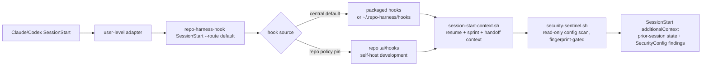
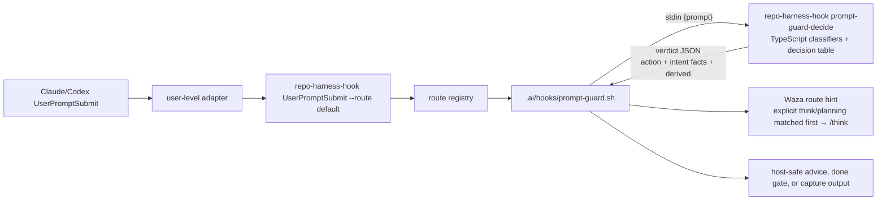

# repo-harness

<p align="center">
  
</p>

`repo-harness` turns Claude/Codex coding sessions into a repeatable repo-local
workflow. It ships a CLI plus skill/runtime hooks that write context, plans,
handoffs, checks, and review evidence back into the project, so the next agent
session can continue from files instead of chat memory.

Use it to:

- adopt an existing repo with a tasks-first agent contract
- keep Claude and Codex aligned on the same plans, checks, handoffs, and context
  boundaries
- spend fewer tokens rediscovering structure by using CodeGraph and progressive
  context loading

Give the agent a complete PRD or Sprint; after that, your loop is just review
and `next`, or start `/goal` and go AFK.

Repository: `https://github.com/Ancienttwo/repo-harness`

[English](README.md) | [简体中文](README.zh-CN.md) | [日本語](README.ja.md) | [Français](README.fr.md) | [Español](README.es.md)

## Controller V7: Execution First, Risk Adaptive, Task Local

repo-harness V7 removes Issue-wide workflow ceremony from the execution path. The Controller is a bridge for local capabilities and evidence; Task-local state and real safety boundaries decide whether work can run.

- `inspect_task_readiness`, `dispatch_task`, `launch_issue`, and cross-project dispatch all evaluate one Task at a time. Unrelated blocked Tasks, multiple active Issues, and current focus do not block independent work.
- Missing named checks are warnings. Checks become completion evidence and execute automatically after a successful Run when the Task declares them.
- Read-only, low-risk, medium-risk, high-risk, and destructive Tasks receive progressively stronger verification and approval requirements. Read-only and low-risk work no longer pays a five-stage acceptance tax.
- Successful Runs automatically continue into applicable checks, verification, auto-completion, or human acceptance. Startup deadlocks and contradictory Job/Run terminal timestamps are reconciled.
- Quick Agent sessions are ephemeral by default and stay out of the durable Issue board; terminal sessions clean their temporary Issue metadata while retaining Run evidence.
- Real hard boundaries remain: sensitive/out-of-scope paths, overlapping writes, irreversible Git actions, remote publication, real check failures, and high-risk data mutations.
- Repository glob semantics, targeted reads, progress, snapshot/log size, Connector surface drift, and reported command evidence are normalized.

The MCP surface is `controller-execution-first-v7`, schema `9`, surface version `7`. See [V7 Execution First](docs/repo-harness-execution-first-v7.md).

## Controller V6: Direct Change First

repo-harness V6 makes actual repository changes the default result for known, bounded work. Creating an Issue is no longer the first step for a small documentation, configuration, or code change.

- `assess_work_request` classifies work as `direct_edit`, `quick_agent`, or `issue_task` before any durable planning object is created.
- Known low-risk changes use a bounded transaction: read the file and SHA, open an edit session, apply an atomic patch, inspect the persisted unified diff, run named checks, and finalize or roll back.
- Direct edits do not require an Issue or Task. Optional `issueId` and `taskId` links are available when the change belongs to an existing execution line.
- Every edit session records changed files, changed-line estimates, before/after hashes, a persisted patch, check artifacts, reviewer, timestamps, finalization, and rollback evidence.
- The localhost Controller promotes **File Changes** to a primary view. It shows the real patch and verification state instead of presenting Issue creation as delivery.
- `create_issue` is reserved for uncertain, multi-file, long-running, parallel, high-risk, or dependency-managed work. Existing V5 focus, governance, retry, evidence-gate, closure, and archiving behavior remains available for that path.
- `read_repository_file` returns the full-file SHA-256 even for a line-range read, so direct replacements can use an explicit stale-write precondition.
- The MCP fingerprint is `controller-direct-change-v6`; the default Connector name is `repo-harness-controller-v6`.

See [V6 Direct Change First](docs/repo-harness-direct-change-v6.md), [V6 verification record](docs/repo-harness-v6-verification.md), [ChatGPT MCP setup](docs/repo-harness-chatgpt-mcp-setup.md), and [Local Execution Bridge](docs/repo-harness-local-execution-bridge.md).

## Why repo-harness

- **File-backed sessions, not chat memory.** Separate agent sessions — Claude and
  Codex, now and later — stay coordinated through the repo, not a thread.
  `.ai/hooks/session-start-context.sh` injects the prior session's resume packet
  (`.ai/harness/handoff/resume.md`, `tasks/current.md`) when a new session starts;
  `finalize-handoff.sh` and `post-edit-guard.sh` write the next handoff back on stop
  and after edits. A session can end mid-task and the next one resumes the exact next
  step, blockers, and changed files without re-deriving them.
- **Token-lean by design.** Instead of grep-and-read loops that re-scan the repo every
  session, the harness leans on a pre-built CodeGraph index for structural queries
  (callers, callees, definitions) and on progressive context loading via
  `.ai/context/context-map.json` and `capabilities.json`: a small, stable root context
  (~12KB) plus capability blocks loaded only when the files you touch need them. Agents
  read a 1KB capability contract or query the index instead of spending thousands of
  tokens rediscovering structure.

In an adopted repo, the surface area is intentionally small:

| Surface                                                         | Purpose                                                                                       |
| --------------------------------------------------------------- | --------------------------------------------------------------------------------------------- |
| `docs/spec.md` and `docs/reference-configs/`                    | Shared standards and stable product intent that every agent session can read.                 |
| `plans/`, `plans/prds/`, and `plans/sprints/`                   | Decision-complete work packages before implementation starts.                                 |
| `tasks/contracts/`, `tasks/reviews/`, and `.ai/harness/checks/` | Scope, verification, and review evidence for proving the work is done.                        |
| `.ai/harness/handoff/` and `tasks/current.md`                   | Session journal and resumable status, derived from workflow artifacts instead of chat memory. |

## Human Review Path

Start with `tasks/reviews/<task>.review.md`. The `## Human Review Card` is the
one-screen decision surface: verdict, change type, intended vs actual files,
commands passed, external acceptance, residual risk, reviewer action, and
rollback. Then inspect the active contract, latest trace in
`.ai/harness/checks/latest.json`, and the changed files. Accept only when the
review recommends pass, the card verdict is pass, and external acceptance is
pass, `not_required`, or an explicit manual override.

## Agent Tracking Path

Agents read source artifacts before derived summaries:

| Agent reads first                        | Human reviews first                                |
| ---------------------------------------- | -------------------------------------------------- |
| Current user prompt and referenced files | `tasks/reviews/<task>.review.md` Human Review Card |
| `AGENTS.md` / `CLAUDE.md`                | Changed files and diff                             |
| Active plan in `.ai/harness/active-plan` | Active contract allowed paths and exit criteria    |
| Active contract in `tasks/contracts/`    | `.ai/harness/checks/latest.json` and run trace     |
| Latest handoff in `.ai/harness/handoff/` | Residual risks and rollback                        |

`tasks/current.md` is only an orientation snapshot. If it disagrees with the
active plan, contract, review, checks, or handoff, the source artifacts win.

## What's New

Release notes live in [`docs/CHANGELOG.md`](docs/CHANGELOG.md). The current line
is `1.3.0`.

## How It Works

The design has three layers:

1. **Source package**: this repository owns the CLI, CLI-backed command facades,
   templates, hook assets, workflow contract, tests, and release gate.
2. **Target repo contract**: `repo-harness adopt` or migration writes repo-local
   files such as `docs/spec.md`, `plans/`, `tasks/`, `.ai/context/`,
   `.ai/harness/`, helper scripts, and `.ai/hooks/`.
3. **Host adapters**: user-level `~/.claude/settings.json` and
   `~/.codex/hooks.json` route Claude/Codex events into `repo-harness-hook`.

The hook entrypoint exits silently for non-opt-in repos. For opted-in repos,
it resolves hooks central-first through the packaged install or
`~/.repo-harness/hooks/`, with repo policy able to pin self-host development
back to `.ai/hooks/*`.

For `UserPromptSubmit`, the public adapter contract stays
`repo-harness-hook UserPromptSubmit --route default`. The CLI route registry
dispatches that route to `.ai/hooks/prompt-guard.sh`. The shell hook remains the
repo-local adapter for host JSON parsing, workflow file reads, capture side
effects, and host-safe stdout/stderr. It pipes the prompt text into
`repo-harness-hook prompt-guard-decide`, where every prompt-text intent
classifier (Unicode-aware, `src/cli/hook/prompt-intents.ts`) and the
`intent x plan state` decision table live; the engine returns one verdict JSON
line with the action, the classified intent facts, and derived strings. The
shell keeps no duplicate classifier or fallback decision table — when the
engine is unreachable the prompt layer degrades to a one-shot advisory.

Prompt-layer plan/spec/contract gates are advisory routing. At the edit
boundary, `pre-edit-guard.sh` keeps path/scope and private-surface safety hard,
while plan-state guidance defaults to `advice` (policy
`.guards.edit_plan_gate`: advice | enforce | off). Done-claim gates block only
when real file-backed completion evidence is failed or missing.

The core invariant is that durable truth lives in the repo, not in a chat
thread. Hooks are accelerators and guardrails; the authority remains the
file-backed plan, contract, review, checks, and handoff artifacts.

## Task Workflow: Plan to Closeout

The diagram below assumes the harness is already installed in the repo. It shows
the normal lifecycle from a program sprint backlog down to one contract task:
draft or select the task, project it into execution files, check out the
contract worktree when policy requires it, implement under hooks, verify, review,
complete the sprint task when applicable, and close out. The 0.4.x loop-system
surfaces add scheduled heartbeat discovery, state-snapshot/eval evidence for
routing changes, architecture queue freshness, and optional contract-run
delegation without changing the file-backed authority model.

```mermaid
flowchart TD
  Program["Program goal or release theme"] --> Sprint{"Sprint layer needed?"}
  Sprint -->|yes| PRD["Upper-layer PRD<br/>plans/prds/*.prd.md"]
  PRD --> SprintDoc["Sprint backlog<br/>plans/sprints/*.sprint.md"]
  SprintDoc --> NextTask["Select next sprint task<br/>sprint-backlog.sh next"]
  Sprint -->|no| UserTask["User task or planning prompt"]
  Heartbeat["Heartbeat triage<br/>scripts/heartbeat-triage.sh<br/>.ai/harness/triage/"] --> UserTask
  NextTask --> UserTask

  UserTask --> Discovery["Due diligence<br/>P1 map, P2 trace, P3 decision"]
  Discovery --> LoopEvidence["Loop evidence when routing changes<br/>state-snapshot --json<br/>route-nl-vs-ts / cutover gate"]
  LoopEvidence --> PlanDraft["Draft plan<br/>plans/plan-*.md"]
  PlanDraft --> PlanReview{"Plan ready for execution?"}
  PlanReview -->|no| Refine["Refine plan, scope, evidence contract"]
  Refine --> PlanDraft
  PlanReview -->|yes| Approve["Approved plan<br/>Status: Approved"]

  Approve --> Project["Project plan into execution<br/>capture-plan.sh --execute<br/>or plan-to-todo.sh --plan"]
  Project --> Active["Active markers<br/>.ai/harness/active-plan<br/>.ai/harness/active-worktree"]
  Project --> SprintActive["Sprint projection<br/>active-sprint marker<br/>tasks/current.md"]
  Project --> Contract["Sprint contract<br/>tasks/contracts/YYYYMMDD-HHMM-task-slug.contract.md"]
  Project --> ReviewFile["Review file<br/>tasks/reviews/YYYYMMDD-HHMM-task-slug.review.md"]
  Project --> Notes["Task notes<br/>tasks/notes/YYYYMMDD-HHMM-task-slug.notes.md"]

  Contract --> Delegation["Delegation contract<br/>budget / permission_scope / roles"]
  Delegation --> Delegate{"Use contract-run delegation?"}
  Delegate -->|yes| ContractRun["Worker/verifier child run<br/>scripts/contract-run.ts"]
  Delegate -->|no| WorktreePolicy{"Contract worktree required?"}
  WorktreePolicy -->|yes| Checkout["Checkout isolated worktree<br/>contract-worktree.sh start --plan<br/>branch codex/task-slug"]
  WorktreePolicy -->|no| CurrentTree["Use current worktree<br/>small or explicitly allowed slice"]
  Checkout --> Implement
  CurrentTree --> Implement
  ContractRun --> Changes

  Implement["Edit and run commands"] --> PreHooks["Pre-edit guards<br/>PlanStatusGuard, ContractScopeGuard, WorktreeGuard"]
  PreHooks -->|blocked| ScopeFix["Fix plan, contract, worktree, or scope"]
  ScopeFix --> Implement
  PreHooks -->|allowed| Changes["Code, docs, tests, or config changes"]
  Changes --> PostHooks["Post-edit and post-bash hooks<br/>trace, drift request, handoff, check evidence"]
  PostHooks --> ArchQueue["Architecture queue<br/>architecture-queue.sh record/reindex<br/>check-architecture-sync.sh"]
  ArchQueue --> Verify["Run verification<br/>tests plus repo workflow checks"]

  Verify --> Checks["Structured evidence<br/>.ai/harness/checks/latest.json<br/>.ai/harness/runs/*.json"]
  Checks --> CheckReview["Evaluator review<br/>Waza /check -> review file"]
  CheckReview --> External["External acceptance advice<br/>or explicit manual override"]
  External --> DoneGate{"Contract, checks, review, and acceptance pass?"}
  DoneGate -->|no| Repair["Repair failing evidence or implementation"]
  Repair --> Implement
  DoneGate -->|yes| SprintComplete{"Sprint task active?"}
  SprintComplete -->|yes| MarkSprint["Mark backlog item complete<br/>sprint-backlog.sh complete-task"]
  SprintComplete -->|no| Closeout["Closeout<br/>scripts/contract-worktree.sh finish"]
  MarkSprint --> Closeout

  Closeout --> Commit["Commit contract branch"]
  Commit --> Merge["Fast-forward target branch"]
  Merge --> Archive["Archive plan/todo and refresh handoff"]
  Archive --> Cleanup["Cleanup merged worktree<br/>contract-worktree.sh cleanup"]
  Cleanup --> Done["Reviewable completed task"]
```



## Long-Running Product Loops

For Greenfield and Brownfield work, front-load discovery and engineering-plan
judgment in Claude-Fable before asking Codex to loop on execution:

1. In Claude-Fable, use gstack `office-hours` for product discovery or
   `plan-eng-review` for engineering plan review. The output should be the
   development documents that lock product intent, architecture, risks, and the
   evidence contract.
2. Turn those documents into an upper-layer PRD under `plans/prds/`, then into
   an ordered sprint backlog under `plans/sprints/` with detailed sub-plans for
   each execution slice.
3. In Codex, create a Goal that points at that sprint file. The harness can then
   project each sprint item through the normal plan -> contract -> worktree ->
   verification flow.

That handoff keeps long-running loops precise: Claude-Fable owns the broad
front-loaded judgment, the PRD remains the upper source of truth, the sprint
backlog is the durable execution queue, and Codex Goal mode resumes against a
concrete sprint instead of reinterpreting the original chat.

## First 5 Minutes

This is the fastest path for an AI tooling owner evaluating whether the workflow is
safe to adopt in a real repo. It separates the machine-level runtime bootstrap
from the repo-local contract install, so a dry run can show exactly what will
change before anything is applied.

Prerequisites: a Git working tree, `bash`, and `bun` (for follow-up verification
and template assembly). `jq` is optional for `--dry-run`, but recommended when
applying settings merges.

### 1. Install the CLI

No Node.js required for the default path: the installer uses Bun as the runtime.
If Bun is missing, it installs Bun first, then installs the `repo-harness` CLI.

```bash
# macOS / Linux
curl -fsSL https://raw.githubusercontent.com/Ancienttwo/repo-harness/main/install.sh | sh

# Windows (PowerShell)
irm https://raw.githubusercontent.com/Ancienttwo/repo-harness/main/install.ps1 | iex
```

<details>
<summary>Already have Bun? Use Bun directly, or npx as a fallback</summary>

```bash
# Bun (recommended)
bun add -g repo-harness
repo-harness install

# npx fallback, with Bun already on PATH because the CLI runs on Bun
npx -y repo-harness install
```

</details>

### 2. Bootstrap the host runtime once

```bash
repo-harness install
```

`install` is the first-run global bootstrap path. It installs the current npm
package as the global CLI, refreshes repo-harness skill aliases, installs
user-level hook adapters, configures Waza runtime skills, persists a brain root
under `~/.repo-harness/config.json`, and configures CodeGraph MCP. It does not
apply repo-local workflow files to the current directory. `repo-harness init`
remains a compatibility alias for existing scripts.

For an Agent-owned, read-only bootstrap audit, run `repo-harness setup check
--json` or add `--check-updates` for version advisories. `setup check` is
not a runtime hook: it does not write user-level files, install updates, or
register adapters. It emits `agent_actions` with the reason, risk, target files,
optional command, and verification surface for the Agent to execute deliberately.
`repo-harness init-hook` remains a compatibility alias.

### Install and refresh examples

```bash
# Refresh user-level CLI/runtime pieces after a package update.
repo-harness update

# Remove managed host adapters without touching sibling or third-party hooks.
repo-harness uninstall

# Install only the host hook adapters (older adapter-only surface).
repo-harness install --target both --location global

# Read-only repair guidance, no writes.
repo-harness update --check

# Refresh repo-local workflow files in an adopted repository.
repo-harness adopt --repo /path/to/repo
```

### 3. Preview the repo-local contract

```bash
repo-harness adopt --dry-run
```

Run the dry run from the target repository root. It reports the specs, task
state, helper runtime, hook adapter target, and verification files that would be
created or refreshed. It should not create an application stack; existing repos
use `repo-harness adopt`, while new projects or modules use
`repo-harness-scaffold`.

### 4. Apply, then prove the workflow

```bash
repo-harness adopt
bash scripts/check-task-workflow.sh --strict
bun test
```

After apply, the repo should have a reviewable file-backed contract rather than
tool-specific chat setup. Agents should be able to find the stable intent in
`docs/spec.md`, execution state in `plans/` and `tasks/`, and resume state in
`.ai/harness/handoff/`.

For a new project or module, use the branch command `repo-harness-scaffold`
instead of `adopt`; it installs or refreshes the harness without creating an
application stack. Maintainers editing the package itself need a source checkout
— see [Maintainer Reference](#maintainer-reference).

### Success looks like this

The command should end with `=== Migration Report ===` and summarize:

- `Project hooks synced from:` to show where generated hook behavior comes from
- `Host hook config target: user-level ~/.claude/settings.json and ~/.codex/hooks.json` to show the adapter layer
- `Host hook adapters are user-level:` to remind the user to install global adapters and trust `~/.codex/hooks.json`
- `Workflow migration:` to show the repo-local harness surfaces it will create or refresh
- `Helper runtime:` to show `.ai/harness/scripts/*` implementations and `scripts/*` compatibility wrappers after apply
- `--- External Tooling ---` to show default gstack/Waza/gbrain routing plus advisory install/update hints

If the dry-run output looks wrong, stop there and inspect
[`docs/reference-configs/hook-operations.md`](docs/reference-configs/hook-operations.md)
before applying anything.

## MCP Connector Quickstart

`repo-harness mcp` can run ChatGPT as the project controller rather than only as
a planning sidecar. The recommended `controller` profile combines four bounded
capabilities:

- inspect repository code, documents, Git state, Issues, Tasks, and Runs;
- maintain durable Issue/Task state under `tasks/issues/`;
- apply small SHA-guarded edits with limits, backups, diff review, and rollback;
- dispatch ready Tasks to allowed local Codex/Claude workers or visible GitHub Copilot cloud sessions.

The controller does not expose arbitrary shell input and never automatically pushes or merges remote pull requests. Local Agent Runs are persistent and use automatic execution placement: a single local Run works directly in the current workspace, while concurrent Runs use isolated Git worktrees. Successful isolated Runs are automatically integrated into the current workspace and their temporary worktree/branch is removed; conflicts preserve the worktree for review. GitHub-mode Tasks can publish Issues/Task sub-issues to a Project and open visible Copilot coding-agent sessions with draft pull requests. Changes still pass the Verification Gate before acceptance.

```bash
repo-harness mcp setup chatgpt --repo .
repo-harness mcp keepalive --repo . --profile controller \
  --enable-dev-runner --dev-runner-agents codex,claude --tunnel quick
```

For the `controller` profile, keepalive also starts a localhost-only task workstation at `http://127.0.0.1:8766/`. Its Overview, Progress Center, Task Management, Run Monitor, Worklog, Approvals, Checks, and GitHub Plugin areas expose the current Agent phase, command or file activity, semantic progress, heartbeat, live output, diff, execution mode, and automatic-integration state. You can launch ready Tasks, create a small Codex/Claude session, approve local Job Tickets, and execute named checks without repeatedly typing scripts. Use `--open-local-ui` to open it automatically or `--no-local-ui` to disable it.

The generated setup guide is written to:

```text
docs/repo-harness-chatgpt-mcp-setup.md
```

The daily model is:

```text
Issue
  -> Task T1 -> Run 1 -> review/accept or retry
  -> Task T2 -> Run 1
  -> Task T3
```

Typical ChatGPT requests:

```text
Read the project snapshot and current code. Create an Issue and split it into
small dependency-aware Tasks. Do not execute yet.
```

```text
Dispatch at most two path-independent ready Tasks. Review every completed Run
before accepting it and unlock dependent Tasks only after acceptance.
```

For a small local fix, ChatGPT can use a bounded edit session instead of
creating a large Sprint. For large product work, PRD, checklist Sprint, Plan,
Contract, Review, and handoff artifacts remain available above the Issue/Task
layer. The legacy `planner`, `executor`, and `orchestrator` profiles and
`run_agent_goal` handoff remain supported for compatibility, but new work should
prefer persistent Issue -> Task -> Run state with an explicit Verification Gate.

Focused verification is exposed through named checks only. Safe package scripts
(`test*`, `check*`, `lint*`, `typecheck*`) are discovered automatically, and
additional fixed command arrays can be declared in `.repo-harness/checks.json`.
See [ChatGPT Controller Workflow](docs/repo-harness-chatgpt-controller.md) and
[GitHub Issue Launcher](docs/repo-harness-github-issue-launcher.md), and [Local Execution Bridge](docs/repo-harness-local-execution-bridge.md) for the state model, GitHub Projects/session integration, visual approval queue, security boundaries, and operating examples.

## Hook Authority Map

- `.ai/hooks/` is the only shared hook implementation you should edit first.
- `~/.claude/settings.json` is the user-level Claude adapter that dispatches into opted-in repos.
- `~/.codex/hooks.json` is the user-level Codex adapter that dispatches into the same runner.
- Repo-local `.claude/settings.json` and `.codex/hooks.json` hook adapters are legacy project-level config and should be retired during migration.
- Codex must mark `~/.codex/hooks.json` as trusted in Codex Settings before those hooks run.
- Debug in this order: user-level adapter config -> `repo-harness-hook` (or fallback `repo-harness hook`) -> route registry -> `.ai/hooks/*`.
- If `repo-harness-hook` reports `.ai/hooks` drift, refresh the repo-local copy with `repo-harness adopt --repo <root>`.

The installed adapter owns eight managed hook routes. The route tuple
`event + routeId + matcher` is the stable contract; script names are the current
implementation under `assets/hooks/` or a repo-pinned `.ai/hooks/` copy.

| Route                      | Matcher      | Scripts                                            | Function                                                                                                       |
| -------------------------- | ------------ | -------------------------------------------------- | -------------------------------------------------------------------------------------------------------------- | --------------------------------------------------------------------------------------------------------------- | ----------------------------------------------------------------------------------------------- |
| `SessionStart.default`     | all sessions | `session-start-context.sh`, `security-sentinel.sh` | Injects prior handoff, sprint status, and read-only config-security findings before work starts.               |
| `PreToolUse.edit`          | `Edit        | Write`                                             | `worktree-guard.sh`, `pre-edit-guard.sh`                                                                       | Enforces worktree/path safety; plan readiness is advisory by default and may be explicitly enforced.                               |
| `PreToolUse.subagent`      | `Task        | Agent                                              | SendUserMessage`                                                                                               | `subagent-return-channel-guard.sh`                                                                              | Keeps delegated work returning through the parent session instead of leaking completion claims. |
| `PostToolUse.edit`         | `Edit        | Write`                                             | `post-edit-guard.sh`                                                                                           | Records edit traces, refreshes handoff/task status, and queues architecture drift when controlled files change. |
| `PostToolUse.bash`         | `Bash`       | `post-bash.sh`                                     | Observes command results and captures verification evidence without replacing the command runner.              |
| `PostToolUse.always`       | all tools    | `post-tool-observer.sh`                            | Provides low-noise always-on trace and runtime observation; stale pinned copies soft-skip with a refresh hint. |
| `UserPromptSubmit.default` | all prompts  | `prompt-guard.sh`                                  | Classifies prompt intent, routes planning/check/hunt hints, and renders host-safe workflow guidance.           |
| `Stop.default`             | session stop | `stop-orchestrator.sh`                             | Finalizes handoff and guards against ending with unresolved draft-plan or completion evidence gaps.            |

`SessionStart` resolves hooks central-first, then runs two ordered scripts before
work begins:



`SessionStart` and `Stop` hooks are advisory for missing repo-local scripts: stale
repos get a drift warning instead of a startup failure. Required guard routes,
including edit and prompt gates, still fail closed when their scripts are
missing.

Prompt guard has one extra internal step:



The shell layer owns filesystem authority and side effects. TypeScript owns all
prompt-text classification plus the `intent x plan state` decision table.
Plan-state blocks render at the PreToolUse edit layer, not here.

## Hook Failure Playbook

When a hook blocks work, start with the structured output in the terminal. The core
fields are `guard`, `reason`, `fix`, `failure_class`, and `run_id`.

- Failure log: `.ai/harness/failures/latest.jsonl`
- Trace log: `.claude/.trace.jsonl`
- Deep guide: [`docs/reference-configs/hook-operations.md`](docs/reference-configs/hook-operations.md)

Most common guards:

- `PlanStatusGuard` (edit layer): an implementation edit was attempted with no active plan, or the plan is not ready to execute; the prompt layer emits the same guard name as advisory guidance
- `ContractGuard`: approved execution has not yet produced the contract/review/notes scaffold
- `ContractGuard`: completion was claimed before the task contract passed
- `WorktreeGuard`: writes were attempted in the primary worktree while linked worktrees are enforced

## Repo Workflow

- Root routing docs: `CLAUDE.md`, `AGENTS.md`
- Shared hook layer: `.ai/hooks/`
- User-level adapter layer: `~/.claude/settings.json`, `~/.codex/hooks.json`
- Active execution surface: `tasks/`
- Plan source of truth: `plans/`
- Durable progress: `tasks/workstreams/`
- Release history: `docs/CHANGELOG.md`

## Current Release

- npm package: `repo-harness@1.3.0`
- Generated workflow stamp: `repo-harness@1.3.0+template@1.3.0`
- GitHub repository: `Ancienttwo/repo-harness`
- Release history: [`docs/CHANGELOG.md`](docs/CHANGELOG.md)

## Acknowledgements and Workflow Influences

`repo-harness` is built around a small set of external skills, repos, and agent
runtimes that
proved useful while this project was being designed, debugged, and released.
They are acknowledged here because they shaped the workflow contract, but they
are not ordinary bundled product dependencies.

| Tool or repo                                                                                                          | Used for                                                                                                                                                      | Dependency shape                                                                                                                                                                             |
| --------------------------------------------------------------------------------------------------------------------- | ------------------------------------------------------------------------------------------------------------------------------------------------------------- | -------------------------------------------------------------------------------------------------------------------------------------------------------------------------------------------- |
| [Hylarucoder](https://x.com/hylarucoder) / Geju                                                                       | P1/P2/P3 due-diligence method and Geju practice that shaped the planning, tracing, and decision-rationale discipline in this workflow                         | Methodology contribution and acknowledgement; not a bundled dependency                                                                                                                       |
| Waza by [TW93](https://x.com/HiTw93), including `think`, `hunt`, `check`, and `health`                                | Daily planning, bug hunts, verification, health checks, and Codex-first skill sync                                                                            | Installed through the skills CLI into host skill roots                                                                                                                                       |
| gstack skills and `gbrain` by [Garry Tan](https://x.com/garrytan)                                                     | Product discovery, plan review, design review, post-ship documentation hygiene, knowledge sync, handoff retrieval, and long-form repo memory                  | External operator workflow plus optional external CLI/index; advisory by default                                                                                                             |
| `mermaid`                                                                                                             | Human-readable architecture and system-flow diagrams when Mermaid is not enough                                                                               | Runtime-referenced skill, not vendored into generated repos                                                                                                                                  |
| CodeGraph (`@colbymchenry/codegraph`)                                                                                 | Symbol-aware navigation, impact tracing, and readiness checks for this self-host repo                                                                         | Dev dependency in this repo; generated repos stay global-MCP-first unless policy opts in                                                                                                     |
| [Oracle](https://github.com/steipete/oracle) by [Peter Steinberger](https://x.com/steipete) (`@steipete/oracle`, MIT) | Default GPT Pro / ChatGPT Web browser consult engine that the `chatgpt-browser` Oracle provider shells out to for `gptpro` consults                           | Externally-resolved binary (`--oracle-bin`, `REPO_HARNESS_ORACLE_BIN`, `node_modules/.bin`, or `PATH`); never auto-downloaded, and a missing binary is a hard `ORACLE_NOT_INSTALLED` failure |
| OpenAI Codex                                                                                                          | Primary execution agent for repo-local implementation, verification, and GitHub contributor attribution when a commit materially includes Codex-authored work | External agent runtime; attribution is an explicit commit trailer, not hidden hook automation                                                                                                |

### GitHub Contributor Attribution

When Codex materially contributes to a commit, use GitHub's standard co-author
trailer format at the end of the commit message:

```text
Co-authored-by: codex <codex@openai.com>
```

Keep this opt-in and visible per commit. Do not bake it into downstream
repo-harness commit scripts or hooks unless that repo explicitly adopts the same
policy.

## Action Command Skills

Source-owned command facades live in `assets/skill-commands/`. They keep host
skill discovery compatible while the CLI and hooks own execution:

- Planning and review: `repo-harness-plan`, `repo-harness-review`, `repo-harness-autoplan`
- Product planning layer: `repo-harness-prd` (activates `$geju`, then uses Claude-first `claude -p --model opus` drafting with Codex fallback to write upper-layer PRDs in `plans/prds/`)
- Sprint program layer: `repo-harness-sprint` (ordered sprint backlogs in `plans/sprints/`, each row expanded with `$think` before the contract flow)
- Goal session layer: `repo-harness-goal` / `repo-harness:goal` (prepares Codex/Claude `/goal` prompts from detailed PRD or Sprint artifacts and asks for those docs when missing)
- GPT Pro local setup layer: `repo-harness-gptpro-setup` / `repo-harness:gptpro_setup` (guides `gptpro_browser` browser/session setup and `gptpro_mcp` ChatGPT Connector MCP setup while keeping ChatGPT Pro separate from API quota)
- GPT Pro consult layer: `repo-harness-gptpro` / `repo-harness:gptpro` (uses `gptpro consult/read/continue/open` language while mapping to the local ChatGPT Web browser session engine)
- Repo workflow actions: `repo-harness-ship`, `repo-harness-init`, `repo-harness-migrate`, `repo-harness-upgrade`, `repo-harness-capability`, `repo-harness-architecture`, `repo-harness-handoff`, `repo-harness-deploy`, `repo-harness-repair`, `repo-harness-check`
- Branch project creation command: `repo-harness-scaffold`

The planning chain is intentionally layered:

```text
idea -> repo-harness-prd -> repo-harness-sprint from-prd -> repo-harness-goal
```

Use `repo-harness-prd` when the source is still a product idea; it first runs a
`$geju` direction pass, then asks Claude via `claude -p --model opus` to draft the PRD, with
Codex only as fallback. Use
`repo-harness-sprint from-prd <plans/prds/*.prd.md>` to turn an approved PRD into
an ordered Sprint backlog with machine-checkable acceptance lines. Use
`repo-harness-goal` only after a detailed PRD or Sprint artifact exists; it
prepares a bounded Codex/Claude `/goal` prompt and keeps the PRD/Sprint as the
source of truth. If that document is missing, the goal command must ask for it
instead of starting implementation from chat context.

`repo-harness adopt` is for an existing repo; `repo-harness-scaffold` creates a
new project or module scaffold as a side command. `hooks-init`, `docs-init`, and
`create-project-dirs` are internal steps, not public commands.

`repo-harness-scaffold` keeps the A-K plan catalog as the project-type authority
and layers optional overlays on top: an `ai_native_profile` overlay (default
`none`) for AI-native app structure, and a separate webapp-rendering overlay
(client-only Vite as Plan B, or TanStack Start + Vite on a Cloudflare Worker as
Plan C). Overlays never install model providers or force a language default.

Use `repo-harness-capability` when the harness already exists and only selected
capability boundaries should be added. It updates `.ai/context/capabilities.json`,
syncs the requested local `AGENTS.md` / `CLAUDE.md` contract files, and validates
the registry without running a full init, migrate, or upgrade pass.

Use `repo-harness-architecture`, `repo-harness-handoff`, and `repo-harness-deploy`
for focused architecture documentation, rollover, and deploy/ops readiness
passes. These commands call existing repo-local helpers and keep their scope
narrow instead of refreshing the full harness.

## Maintainer Reference

Maintainers editing the package itself need a source checkout:

```bash
git clone https://github.com/Ancienttwo/repo-harness.git ~/Projects/repo-harness
cd ~/Projects/repo-harness
bun src/cli/index.ts update
```

The `~/Projects/repo-harness` repo is the only editable source of truth; local
Claude/Codex paths (`~/.claude/skills/repo-harness`,
`~/.codex/skills/repo-harness`) are symlink-backed runtime entrypoints. Only
`~/.codex/skills/repo-harness` exposes `SKILL.md` and `assets/skill-commands/`;
`scripts/sync-codex-installed-copies.sh` rebuilds these aliases and removes the
retired `repo-harness-skill` / `project-initializer` directories. The script
links runtime paths back to the source repo by default; set
`AGENTIC_DEV_LINK_INSTALLED_COPIES=0` for copy-based staging, or
`CODEX_SKILLS_ROOT` / `CLAUDE_SKILLS_ROOT` to stage under alternate roots.

### Self-check this repository's workflow contract

Run the full gate in [Verification](#verification); `bun run check:ci` is the
single CI-equivalent command.

### Runtime reference docs

Generic repo-harness runtime/reference docs live in the installed package under
`assets/reference-configs/` and are resolved through the CLI:

```bash
repo-harness docs list
repo-harness docs path harness-overview
repo-harness docs show harness-overview
```

Initializer and runtime defaults (question flow, plan menu, template vars,
external-tooling routing) are documented in `harness-overview.md` under
**Initializer and Runtime Model**. Generated and migrated repos still keep
`docs/reference-configs/*.md`, but those files are deterministic pointer stubs.
Repo-local workflow state, policy, checks, runs, handoff packets, context maps,
and helper snapshots stay under `.ai/`.

### Explicit template assembly

```bash
bun scripts/assemble-template.ts --plan C --name "MyProject"
bun scripts/assemble-template.ts --target agents --plan C --name "MyProject"
```

### Local benchmark skeleton

```bash
bun run benchmark:skills --dry-run
```

Dry-run benchmark output is a wiring smoke only. Release or readiness evidence
needs a non-dry-run eval with grader output.

### Run one eval across both Claude and Codex

```bash
bun run benchmark:skills --eval repair-agents-task-sync
```

## Key Files

- Skill spec: `SKILL.md`
- Root routing docs: `CLAUDE.md`, `AGENTS.md`
- Plan mapping: `assets/plan-map.json`
- Question-pack: `assets/initializer-question-pack.v4.json`
- Shared hooks: `assets/hooks/`
- Runtime reference docs: `assets/reference-configs/` via `repo-harness docs`
- Workflow contract: `assets/workflow-contract.v1.json`
- Source repo reference docs: `docs/reference-configs/*.md`
- Template assembler: `scripts/assemble-template.ts`
- Question inference helper: `scripts/initializer-question-pack.ts`
- State inspector: `scripts/inspect-project-state.ts`
- Legacy-doc migrator: `scripts/migrate-workflow-docs.ts`
- External tooling detector: `scripts/check-agent-tooling.sh`
- Scaffolding scripts:
  - `scripts/init-project.sh`
  - `scripts/create-project-dirs.sh`

## Generated vs Self-Hosted Hook Parity

- Downstream hook behavior is defined by generated output from `assets/hooks/` plus
  `assets/reference-configs/`.
- This repo dogfoods the same contract, but self-host behavior is not magically in
  sync with generated repos unless a change explicitly updates both surfaces.
- Every hook change should say whether it affects `self-host`, `generated`, or `both`.

## Package Manager Defaults

- General default priority: `bun > pnpm > npm`
- **Plan G/H** (Python-centric) default to **`uv`** as primary package manager.

## Runtime Profiles

- `Plan-only (recommended)` (default)
- `Plan + Permissionless`
- `Standard (ask before each action)`

Configured in `assets/initializer-question-pack.v4.json` and consumed by `scripts/initializer-question-pack.ts`.

## Verification

Use the single CI-equivalent gate for release review:

```bash
bun run check:ci
```

The gate expands to the owned checks below; `bun run check:release` adds only the npm unpublished-version preflight before delegating to the same gate.

```bash
bun test
bash scripts/check-deploy-sql-order.sh
bash scripts/check-architecture-sync.sh
bash scripts/check-task-sync.sh
bash scripts/check-task-workflow.sh --strict
bun scripts/inspect-project-state.ts --repo . --format text
bash scripts/migrate-project-template.sh --repo . --dry-run
bash scripts/check-agent-tooling.sh --host both --check-updates
bun run benchmark:skills --eval route-workflow-check
```
