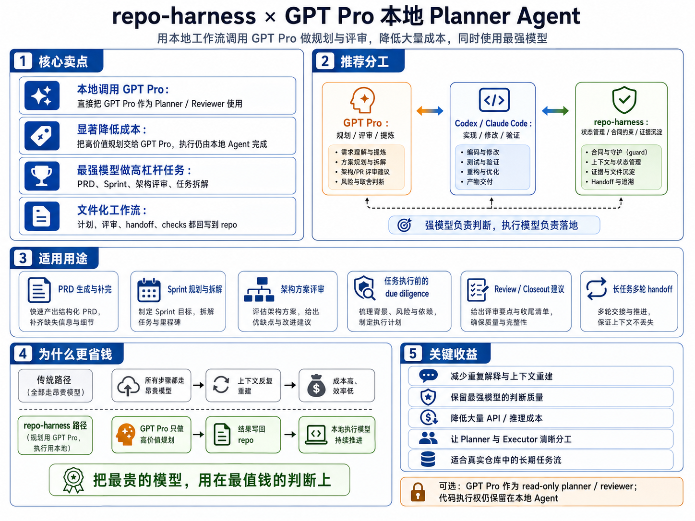
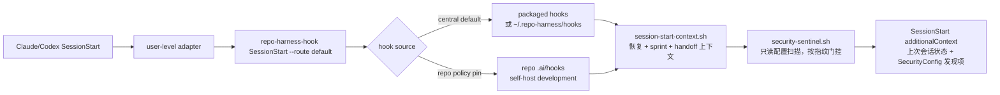
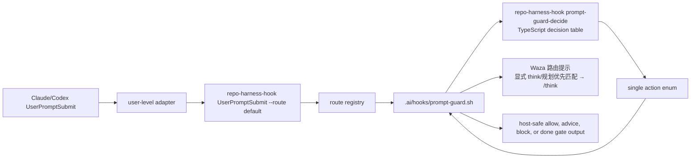

# repo-harness

<p align="center">
  
</p>

`repo-harness` 把 Claude/Codex 的 AI 编程会话变成可复用、可恢复、可检查的
repo-local workflow。它提供 CLI 和 skill/runtime hooks，把上下文、计划、
handoff、检查结果和 review evidence 写回项目文件，让下一个 agent 会话可以从文件继续，
而不是依赖聊天记录。

它主要解决三件事：

- 用 tasks-first agent contract 快速接入已有仓库。
- 让 Claude 和 Codex 共享同一套计划、检查、handoff 和上下文边界。
- 用 CodeGraph 和渐进式 context loading 减少重复摸仓库结构的 token 消耗。

你只需要把完整 PRD/Sprint 发给 Agent；之后的工作就是 review and `next`，
或者启动 `/goal` 后 AFK。

[English](README.md) | [简体中文](README.zh-CN.md) | [日本語](README.ja.md) | [Français](README.fr.md) | [Español](README.es.md)

仓库地址：`https://github.com/Ancienttwo/repo-harness`

## Controller V6：直接变更优先

repo-harness V6 把“项目文件真正发生变化”设为已知小型工作的默认结果。修改文档、配置或明确的小范围代码时，不再先创建 Issue。

- `assess_work_request` 会在创建持久任务前，把请求分为 `direct_edit`、`quick_agent` 或 `issue_task`。
- 已知、低风险的小改动走受限事务：读取文件和 SHA、打开编辑会话、原子应用 Patch、查看持久化 Diff、运行命名检查，最后确认完成或回滚。
- 直接编辑不要求 Issue 或 Task；只有修改属于现有执行主线时，才可选关联 `issueId`、`taskId`。
- 每个编辑会话都记录修改文件、变更行估算、前后 Hash、持久化 Patch、检查工件、审核人、时间、完成与回滚证据。
- 本地 Controller 将“文件变更”提升为一级视图，直接展示真实 Patch 和验证状态，不再把“创建了 Issue”表现成交付结果。
- `create_issue` 只用于目标不明确、多文件、长时间、并行、高风险或需要依赖治理的工作；复杂工作继续使用 V5 的当前主线、治理、重试、证据门禁、收口与归档。
- `read_repository_file` 即使只读取部分行，也返回完整文件 SHA-256，直接替换必须使用过期写入保护。
- MCP 指纹为 `controller-direct-change-v6`，默认 Connector 名为 `repo-harness-controller-v6`。

详见 [V6 直接变更优先](docs/repo-harness-direct-change-v6.md)、[V6 验证记录](docs/repo-harness-v6-verification.md)、[ChatGPT MCP 接入](docs/repo-harness-chatgpt-mcp-setup.md) 和 [Local Execution Bridge](docs/repo-harness-local-execution-bridge.md)。

## 为什么用 repo-harness

- **会话状态落在文件里，不在聊天记录里。** 不同 agent 会话——Claude、Codex、现在或之后——
  靠仓库而不是聊天线程保持同步。新会话启动时 `.ai/hooks/session-start-context.sh` 注入上一会话的
  resume packet（`.ai/harness/handoff/resume.md`、`tasks/current.md`）；会话结束和每次编辑后，
  `finalize-handoff.sh`、`post-edit-guard.sh` 把下一份 handoff 写回。任务可以中途断开，下一个会话
  直接接上准确的下一步、阻塞点和改动文件，不用重新推断。
- **天生省 token。** 不靠每个会话重扫一遍仓库的 grep+read 循环，harness 用预建的 CodeGraph 索引做
  结构化查询（谁调用、调用谁、定义在哪），再用 `.ai/context/context-map.json` 和 `capabilities.json`
  做渐进式上下文加载：一份小而稳定的 root context（约 12KB），加上只在改到对应文件时才加载的
  capability 块。agent 读一份 1KB 的 capability 合约或查索引，而不是花上千 token 重新摸清结构。

接入后的仓库只需要理解几个 surface：

| Surface                                                     | 作用                                                                           |
| ----------------------------------------------------------- | ------------------------------------------------------------------------------ |
| `docs/spec.md` 和 `docs/reference-configs/`                 | 共享标准和稳定产品意图，每个 agent 会话都能读取。                              |
| `plans/`、`plans/prds/`、`plans/sprints/`                   | 实现前先沉淀 decision-complete work package。                                  |
| `tasks/contracts/`、`tasks/reviews/`、`.ai/harness/checks/` | 证明完成所需的 scope、verification 和 review evidence。                        |
| `.ai/harness/handoff/` 和 `tasks/current.md`                | session journal 与可恢复状态，从 workflow artifacts 派生，而不是依赖聊天记忆。 |

## Human Review Path

先读 `tasks/reviews/<task>.review.md`。`## Human Review Card` 是一屏决策面：
verdict、change type、预期/实际改动文件、已通过命令、external acceptance、
残余风险、reviewer action 和 rollback。然后检查 active contract、
`.ai/harness/checks/latest.json` 里的 latest trace，以及实际 diff。只有当 review
recommend pass、card verdict 为 pass，且 external acceptance 为 pass、not_required
或明确 manual override 时，才进入 closeout。

## Agent Tracking Path

Agent 先读 source artifacts，再读派生摘要：

| Agent reads first                            | Human reviews first                                   |
| -------------------------------------------- | ----------------------------------------------------- |
| 当前用户 prompt 和引用文件                   | `tasks/reviews/<task>.review.md` 的 Human Review Card |
| `AGENTS.md` / `CLAUDE.md`                    | changed files 和 diff                                 |
| `.ai/harness/active-plan` 指向的 active plan | active contract 的 allowed paths 和 exit criteria     |
| `tasks/contracts/` 下的 active contract      | `.ai/harness/checks/latest.json` 和 run trace         |
| `.ai/harness/handoff/` 下的 latest handoff   | 残余风险和 rollback                                   |

`tasks/current.md` 只是 orientation snapshot。如果它和 active plan、contract、
review、checks 或 handoff 冲突，以 source artifacts 为准。

## What's New

Release notes 见 [`docs/CHANGELOG.md`](docs/CHANGELOG.md)，当前版本线是 `1.2.0`。

## 工作原理

整体分三层：

1. **源码包层**：本仓库维护 CLI、CLI-backed command facades、templates、hook assets、
   workflow contract、tests 和 release gate。
2. **目标仓库合约层**：`repo-harness adopt` 或 migration 会写入 `docs/spec.md`、
   `plans/`、`tasks/`、`.ai/context/`、`.ai/harness/`、helper scripts 和
   `.ai/hooks/`。
3. **Host adapter 层**：user-level `~/.claude/settings.json` 和 `~/.codex/hooks.json`
   把 Claude/Codex events 路由到 `repo-harness-hook`。hook entrypoint 会先检查当前
   repo 是否存在 `.ai/harness/workflow-contract.json`；没有 opt in 就静默退出。有 opt in
   时按 central-first 解析 packaged install 或 `~/.repo-harness/hooks/`，repo policy
   也可以把自托管开发钉回 `.ai/hooks/*`。

对 `UserPromptSubmit` 来说，公开 adapter contract 仍然是
`repo-harness-hook UserPromptSubmit --route default`。CLI route registry 会把这个
route dispatch 到 `.ai/hooks/prompt-guard.sh`。Shell hook 继续负责 host JSON 解析、
workflow 文件读取、plan capture 副作用、quality gate 渲染，以及 host-safe
stdout/stderr。Prompt intent 和 workflow state 的决策交给
`repo-harness-hook prompt-guard-decide` 背后的 TypeScript decision engine；它从显式
decision table 里返回一个 action enum。这样 host 配置不变，但最容易出错的
classifier/state-machine 层不再散落在 shell 条件分支里。

核心不变量：持久事实在仓库里，不在聊天窗口里。Hooks 只是加速器和 guardrail；
真正的 authority 是 plan、contract、review、checks 和 handoff 这些文件。

## 任务 Workflow：从 Plan 到 Closeout

下面这张图假设目标仓库已经安装 harness。它展示的是从 program sprint backlog
到单个 contract task 的正常闭环：先选择或形成任务，再投射到执行文件，需要时
checkout 隔离 worktree，在 hooks 保护下实现，然后验证、review、external acceptance，
必要时标记 sprint task 完成，最后 closeout。0.4.x 的 loop-system surface
新增 heartbeat 定时发现、state-snapshot/eval 证据、architecture queue freshness，
以及可选的 contract-run 委派，但 source of truth 仍然是 repo 内文件合约。

```mermaid
flowchart TD
  Program["Program goal 或 release theme"] --> Sprint{"需要 sprint layer?"}
  Sprint -->|是| SprintDoc["Sprint PRD + backlog<br/>plans/prds/*.prd.md"]
  SprintDoc --> NextTask["选择下一个 sprint task<br/>sprint-backlog.sh next"]
  Sprint -->|否| UserTask["用户任务或 planning prompt"]
  Heartbeat["Heartbeat triage<br/>scripts/heartbeat-triage.sh<br/>.ai/harness/triage/"] --> UserTask
  NextTask --> UserTask

  UserTask --> Discovery["前置调查<br/>P1 map, P2 trace, P3 decision"]
  Discovery --> LoopEvidence["路由变更时的 loop evidence<br/>state-snapshot --json<br/>route-nl-vs-ts / cutover gate"]
  LoopEvidence --> PlanDraft["Draft plan<br/>plans/plan-*.md"]
  PlanDraft --> PlanReview{"Plan 是否可执行?"}
  PlanReview -->|否| Refine["收敛 scope 和 evidence contract"]
  Refine --> PlanDraft
  PlanReview -->|是| Approve["Approved plan<br/>Status: Approved"]

  Approve --> Project["投射到执行面<br/>capture-plan.sh --execute<br/>或 plan-to-todo.sh --plan"]
  Project --> Active["Active markers<br/>.ai/harness/active-plan<br/>.ai/harness/active-worktree"]
  Project --> SprintActive["Sprint projection<br/>active-sprint marker<br/>tasks/current.md"]
  Project --> Contract["Sprint contract<br/>tasks/contracts/YYYYMMDD-HHMM-task-slug.contract.md"]
  Project --> ReviewFile["Review file<br/>tasks/reviews/YYYYMMDD-HHMM-task-slug.review.md"]
  Project --> Notes["Task notes<br/>tasks/notes/YYYYMMDD-HHMM-task-slug.notes.md"]

  Contract --> Delegation["Delegation contract<br/>budget / permission_scope / roles"]
  Delegation --> Delegate{"是否使用 contract-run 委派?"}
  Delegate -->|是| ContractRun["Worker/verifier child run<br/>scripts/contract-run.ts"]
  Delegate -->|否| WorktreePolicy{"是否需要 contract worktree?"}
  WorktreePolicy -->|是| Checkout["Checkout 隔离 worktree<br/>contract-worktree.sh start --plan<br/>branch codex/task-slug"]
  WorktreePolicy -->|否| CurrentTree["使用当前 worktree<br/>小任务或明确允许的 slice"]
  Checkout --> Implement
  CurrentTree --> Implement
  ContractRun --> Changes

  Implement["编辑和运行命令"] --> PreHooks["Pre-edit guards<br/>PlanStatusGuard, ContractScopeGuard, WorktreeGuard"]
  PreHooks -->|blocked| ScopeFix["修正 plan、contract、worktree 或 scope"]
  ScopeFix --> Implement
  PreHooks -->|allowed| Changes["代码、文档、测试或配置改动"]
  Changes --> PostHooks["Post-edit / post-bash hooks<br/>trace, drift request, handoff, check evidence"]
  PostHooks --> ArchQueue["Architecture queue<br/>architecture-queue.sh record/reindex<br/>check-architecture-sync.sh"]
  ArchQueue --> Verify["运行验证<br/>tests plus repo workflow checks"]

  Verify --> Checks["结构化 evidence<br/>.ai/harness/checks/latest.json<br/>.ai/harness/runs/*.json"]
  Checks --> CheckReview["Evaluator review<br/>Waza /check -> review file"]
  CheckReview --> External["External acceptance advice<br/>或明确 manual override"]
  External --> DoneGate{"Contract、checks、review、acceptance 是否通过?"}
  DoneGate -->|否| Repair["修复失败 evidence 或实现"]
  Repair --> Implement
  DoneGate -->|是| SprintComplete{"存在 active sprint task?"}
  SprintComplete -->|是| MarkSprint["标记 backlog item 完成<br/>sprint-backlog.sh complete-task"]
  SprintComplete -->|否| Closeout["Closeout<br/>scripts/contract-worktree.sh finish"]
  MarkSprint --> Closeout

  Closeout --> Commit["提交 contract branch"]
  Commit --> Merge["Fast-forward target branch"]
  Merge --> Archive["归档 plan/todo 并刷新 handoff"]
  Archive --> Cleanup["清理已合并 worktree<br/>contract-worktree.sh cleanup"]
  Cleanup --> Done["可审查的已完成任务"]
```



## 长周期产品 Loop

Greenfield 和 Brownfield 工作先把 discovery 和工程计划前置在 Claude-Fable
中完成，不要直接让 Codex 从原始聊天长期滚动：

1. 在 Claude-Fable 里用 gstack `office-hours` 做产品 discovery，或用
   `plan-eng-review` 做工程方案评审。输出应当是锁定产品意图、架构、风险和
   evidence contract 的开发文档。
2. 把这些文档转成 `plans/prds/` 下的 PRD Sprint，并为每个 execution
   slice 写清有序 backlog 和详细 sub-plan。
3. 创建 Codex Goal，目标指向该 sprint 文件。repo-harness 之后就可以按既有
   plan -> contract -> worktree -> verification flow 逐项投射和执行。

这个交接让长周期 loop 更精准：Claude-Fable 负责前置判断，PRD Sprint 是 durable
source of truth，Codex Goal mode 只围绕具体 sprint 恢复和推进，而不是反复重新解释原始聊天。

## 前 5 分钟

这是评估一个真实仓库是否适合接入该 workflow 的最快路径。它把机器级 runtime
bootstrap 和 repo-local contract install 分开，所以 dry-run 能先展示会改什么，
再决定是否应用。

前置条件：Git working tree、`bash`、`bun`（用于后续验证和 template assembly）。
`jq` 可选；做 `--dry-run` 时推荐，应用 settings merge 时更有用。

### 1. 安装 CLI

默认路径不需要 Node.js：installer 使用 Bun 作为 runtime。如果机器上没有 Bun，
它会先安装 Bun，再安装 `repo-harness` CLI。

```bash
# macOS / Linux
curl -fsSL https://raw.githubusercontent.com/Ancienttwo/repo-harness/main/install.sh | sh

# Windows (PowerShell)
irm https://raw.githubusercontent.com/Ancienttwo/repo-harness/main/install.ps1 | iex
```

<details>
<summary>已经有 Bun？优先直接用 Bun，也可以把 npx 作为备选</summary>

```bash
# Bun（推荐）
bun add -g repo-harness
repo-harness install

# npx 备选；仍要求 Bun 已在 PATH 上，因为 CLI runtime 是 Bun
npx -y repo-harness install
```

</details>

### 2. 先做一次 host runtime bootstrap

```bash
repo-harness install
```

`install` 是首次全局引导入口。它把当前 npm 包安装成全局 CLI，刷新 repo-harness
skill aliases，安装 user-level hook adapters，配置 Waza runtime skills，把 brain
root 持久化到 `~/.repo-harness/config.json`，并配置 CodeGraph MCP。它不会把当前目录
默认迁移成 repo-local workflow。`repo-harness init` 保留为兼容 alias，给已有脚本用。

如果要让 Agent 做只读 bootstrap audit，运行 `repo-harness setup check
--json`；需要版本提示时加 `--check-updates`。`setup check` 不是 runtime hook：
它不会写 user-level files、安装更新或注册 adapters，只输出带 reason、risk、
targets、可选 command 和 verification 的 `agent_actions`，由 Agent 再显式执行。
`repo-harness init-hook` 保留为兼容 alias。

### 安装和刷新例子

```bash
# 包更新后刷新 user-level CLI/runtime。
repo-harness update

# 移除管理的 host adapters，不动 sibling 或第三方 hooks。
repo-harness uninstall

# 只安装 host hook adapters（旧版 adapter-only surface）。
repo-harness install --target both --location global

# 只读修复建议，不写文件。
repo-harness update --check

# 刷新已接入仓库里的 repo-local workflow 文件。
repo-harness adopt --repo /path/to/repo
```

### 3. 预览 repo-local contract

```bash
repo-harness adopt --dry-run
```

在目标仓库根目录运行 dry-run。它会报告将要创建或刷新的 spec、task state、
helper runtime、hook adapter target 和 verification files。它不会创建应用技术栈；
已有仓库走 `repo-harness adopt`，新项目或新模块走 `repo-harness-scaffold`。

### 4. 应用后验证 workflow

```bash
repo-harness adopt
bash scripts/check-task-workflow.sh --strict
bun test
```

应用后，目标仓库应该得到一套可审查的 file-backed contract，而不是 tool-specific
聊天配置。agent 应该能在 `docs/spec.md` 找到稳定意图，在 `plans/` 和 `tasks/`
找到执行状态，在 `.ai/harness/handoff/` 找到可恢复状态。

新项目或新模块用支线 command `repo-harness-scaffold` 代替 `adopt`；它会安装或
刷新 harness，不会创建应用技术栈。维护者编辑 package 源码需要 source checkout
—— 见 [Maintainer Reference](#maintainer-reference)。

### 成功长什么样

命令最后应该输出 `=== Migration Report ===`，并包含：

- `Project hooks synced from:`：生成的 hook 行为来自哪里
- `Host hook config target: user-level ~/.claude/settings.json and ~/.codex/hooks.json`：adapter 层在哪里
- `Host hook adapters are user-level:`：提醒安装 global adapters，并信任 `~/.codex/hooks.json`
- `Workflow migration:`：repo-local harness surfaces 的创建或刷新计划
- `Helper runtime:`：应用后会得到的操作工具链
- `--- External Tooling ---`：gstack/Waza/gbrain 路由以及 advisory 安装/更新提示

如果 dry-run 输出不对，先停在这里，阅读
[`docs/reference-configs/hook-operations.md`](docs/reference-configs/hook-operations.md)。

## MCP Connector Quickstart

`repo-harness mcp` 现在可以让 ChatGPT 作为项目控制者，而不只是生成规划文档的
sidecar。推荐的 `controller` profile 提供四类受控能力：

- 分析源码、文档、Git 状态、Issue、Task 和 Run；
- 在 `tasks/issues/` 中维护可恢复的 Issue/Task 状态；
- 通过 SHA 前置校验、修改规模限制、备份、diff 和回滚完成小型直接修改；
- 把 ready Task 委派给本地 Codex/Claude worker，或 GitHub 上可见的 Copilot 云端 Session。

Controller 不暴露任意 shell 参数，也不会自动 push 或合并远端 PR。本地 Agent Run 会持久化，并采用自动执行策略：没有其他本地 Run 时直接在当前工作区执行；检测到并发时才创建独立 Git worktree。隔离 Run 成功后会自动集成到当前工作区并立即清理临时 worktree/分支，冲突时保留现场等待处理。GitHub 模式可以把 Issue/Task 子 Issue 发布到 Project，并启动可在 Agents 页面和草稿 PR 中观察的 Copilot 云端 Session。实现进入工作区后仍须记录检查与验收证据并通过 Verification Gate，之后才能明确接受。

```bash
repo-harness mcp setup chatgpt --repo .
repo-harness mcp keepalive --repo . --profile controller \
  --enable-dev-runner --dev-runner-agents codex,claude --tunnel quick
```

`controller` profile 启动 keepalive 时还会默认启动仅监听本机的任务工作台：`http://127.0.0.1:8766/`。工作台提供工作总览、进度中心、Task 管理、执行监控、工作留痕、审批、检查和 GitHub 插件区域；运行中的 Codex/Claude 会显示当前阶段、正在执行的命令或修改文件、语义进度、心跳、实时输出、diff 与自动集成状态。你可以直接启动 ready Task、创建小型会话、批准本地 Job 和运行命名检查，不需要反复手动执行脚本。使用 `--open-local-ui` 可在启动时自动打开页面，使用 `--no-local-ui` 可关闭该能力。

安装命令会生成：

```text
docs/repo-harness-chatgpt-mcp-setup.md
```

日常状态模型是：

```text
Issue
  -> Task T1 -> Run 1 -> review/accept 或 retry
  -> Task T2 -> Run 1
  -> Task T3
```

典型用法：

```text
读取项目快照和相关代码，创建 Issue，并拆成有依赖关系的小 Task，暂时不要执行。
```

```text
最多同时执行两个路径互不冲突的 ready Task；每个 Run 完成后先 review，接受后再解锁后续 Task。
```

小型修复可以直接使用受控 edit session，不必生成完整 PRD/Sprint。大型产品需求仍可在
Issue/Task 之上保留 PRD、checklist Sprint、Plan、Contract、Review 和 handoff。
旧的 `planner`、`executor`、`orchestrator` profile 与 `run_agent_goal` 仍兼容，
但新任务建议统一采用持久化的 Issue -> Task -> Run，并强制经过 Verification Gate。

验证只允许运行命名检查，不接受任意 shell。系统会自动发现安全前缀的 package scripts
（`test*`、`check*`、`lint*`、`typecheck*`），也可以在
`.repo-harness/checks.json` 中配置固定命令数组。完整说明见
[ChatGPT Controller 工作流](docs/repo-harness-chatgpt-controller.md)和
[GitHub Issue Launcher](docs/repo-harness-github-issue-launcher.md)和
[Local Execution Bridge](docs/repo-harness-local-execution-bridge.md)。

## Hook Authority Map

- `.ai/hooks/` 是唯一应该优先编辑的 shared hook implementation。
- `~/.claude/settings.json` 是 user-level Claude adapter，负责 dispatch 到 opted-in repos。
- `~/.codex/hooks.json` 是 user-level Codex adapter，dispatch 到同一个 runner。
- Repo-local `.claude/settings.json` 和 `.codex/hooks.json` hook adapters 是 legacy project-level config，迁移时应退休。
- Codex 必须在 Settings 里信任 `~/.codex/hooks.json`，hooks 才会执行。
- 调试顺序：user-level adapter config -> `repo-harness-hook` 或 fallback `repo-harness hook` -> route registry -> `.ai/hooks/*`。

The installed adapter owns eight managed hook routes. The route tuple
`event + routeId + matcher` is the stable contract; script names are the current
implementation under `assets/hooks/` or a repo-pinned `.ai/hooks/` copy.

| Route                      | Matcher      | Scripts                                            | Function                                                                                                       |
| -------------------------- | ------------ | -------------------------------------------------- | -------------------------------------------------------------------------------------------------------------- | --------------------------------------------------------------------------------------------------------------- | ----------------------------------------------------------------------------------------------- |
| `SessionStart.default`     | all sessions | `session-start-context.sh`, `security-sentinel.sh` | Injects prior handoff, sprint status, and read-only config-security findings before work starts.               |
| `PreToolUse.edit`          | `Edit        | Write`                                             | `worktree-guard.sh`, `pre-edit-guard.sh`                                                                       | Enforces worktree policy and plan/contract readiness before implementation edits.                               |
| `PreToolUse.subagent`      | `Task        | Agent                                              | SendUserMessage`                                                                                               | `subagent-return-channel-guard.sh`                                                                              | Keeps delegated work returning through the parent session instead of leaking completion claims. |
| `PostToolUse.edit`         | `Edit        | Write`                                             | `post-edit-guard.sh`                                                                                           | Records edit traces, refreshes handoff/task status, and queues architecture drift when controlled files change. |
| `PostToolUse.bash`         | `Bash`       | `post-bash.sh`                                     | Observes command results and captures verification evidence without replacing the command runner.              |
| `PostToolUse.always`       | all tools    | `post-tool-observer.sh`                            | Provides low-noise always-on trace and runtime observation; stale pinned copies soft-skip with a refresh hint. |
| `UserPromptSubmit.default` | all prompts  | `prompt-guard.sh`                                  | Classifies prompt intent, routes planning/check/hunt hints, and renders host-safe workflow guidance.           |
| `Stop.default`             | session stop | `stop-orchestrator.sh`                             | Finalizes handoff and guards against ending with unresolved draft-plan or completion evidence gaps.            |

`SessionStart` 先按 central-first 解析 hook source，再按顺序跑两个脚本：



Prompt guard 多一个内部步骤：



Shell 层仍然拥有文件系统 authority 和副作用。TypeScript 只拥有 classifier 加
`intent x plan state` decision table。

## Hook Failure Playbook

hook block 工作时，先看 terminal 里的结构化输出。核心字段是
`guard`、`reason`、`fix`、`failure_class` 和 `run_id`。

- Failure log：`.ai/harness/failures/latest.jsonl`
- Trace log：`.claude/.trace.jsonl`
- 深入指南：[`docs/reference-configs/hook-operations.md`](docs/reference-configs/hook-operations.md)

常见 guards：

- `PlanStatusGuard`：没有 active plan，或 plan 还不能执行
- `ContractGuard`：approved execution 还没有生成 contract/review/notes scaffold
- `ContractGuard`：任务还没通过 contract verification 就声称完成
- `WorktreeGuard`：在强制 linked worktree 策略下，从 primary worktree 写入

## Repo Workflow

- Root routing docs：`CLAUDE.md`、`AGENTS.md`
- Shared hook layer：`.ai/hooks/`
- User-level adapter layer：`~/.claude/settings.json`、`~/.codex/hooks.json`
- Active execution surface：`tasks/`
- Plan source of truth：`plans/`
- Durable progress：`tasks/workstreams/`
- Release history：`docs/CHANGELOG.md`

## 当前 Release

- npm package：`repo-harness@1.2.0`
- Generated workflow stamp：`repo-harness@1.2.0+template@1.2.0`
- GitHub repository：`Ancienttwo/repo-harness`
- Release history：[`docs/CHANGELOG.md`](docs/CHANGELOG.md)

## 致谢

感谢 [Hylarucoder](https://x.com/hylarucoder) 的方法论贡献。`repo-harness`
里的 P1/P2/P3 due-diligence 方法，以及 Geju 实践对 planning、trace 和
decision rationale 的要求，来自他的贡献与启发。

感谢 [TW93](https://x.com/HiTw93) 创作 Waza；`think`、`hunt`、`check`
和 `health` 这些核心 skill 构成了 `repo-harness` 的日常 planning、bug hunt
和 verification 节奏。

感谢 [Garry Tan](https://x.com/garrytan) 创作 gstack 和 gbrain；它们影响了
product discovery、plan/design review、release 文档、knowledge sync 和
handoff retrieval 的工作流设计。

感谢 [Peter Steinberger](https://x.com/steipete) 创作 Oracle（`@steipete/oracle`，MIT）；它是
`chatgpt-browser` 默认的 GPT Pro / ChatGPT Web 浏览器 consult 引擎，Oracle provider
通过 spawn 外部 oracle 二进制完成 `gptpro` consult，从不自动下载，缺失即硬失败。

感谢 OpenAI Codex 作为本仓库主要执行 agent 参与实现、验证和收口。

### GitHub Contributor Attribution

Codex 对某个 commit 有实质贡献时，GitHub contributor 署名使用显式 trailer：

```text
Co-authored-by: codex <codex@openai.com>
```

这条署名保持逐 commit 显式添加，不把它藏进下游 `repo-harness` commit 脚本或 hook
里，除非目标仓库自己采用同样策略。

## Action Command Skills

公共 command facades 在 `assets/skill-commands/`；它们保留 host skill discovery
兼容性，真正执行由 CLI 和 hooks 负责：

- Planning / review：`repo-harness-plan`、`repo-harness-review`、`repo-harness-autoplan`
- Product planning layer：`repo-harness-prd`（先激活 `$geju` 做格局判断，再优先用 Claude `claude -p --model opus` 起草 PRD；Codex 只做 fallback）
- Sprint program layer：`repo-harness-sprint`（把 PRD 拆成 `plans/sprints/` 里的有序 backlog）
- Goal session layer：`repo-harness-goal` / `repo-harness:goal`（从详细 PRD 或 Sprint 文档准备 Codex/Claude `/goal` prompt；缺文档时先要求补文档）
- Repo workflow actions：`repo-harness-ship`、`repo-harness-init`、`repo-harness-migrate`、`repo-harness-upgrade`、`repo-harness-capability`、`repo-harness-architecture`、`repo-harness-handoff`、`repo-harness-deploy`、`repo-harness-repair`、`repo-harness-check`
- 支线项目创建 command：`repo-harness-scaffold`

规划链路按层推进：

```text
idea -> repo-harness-prd -> repo-harness-sprint from-prd -> repo-harness-goal
```

`repo-harness-prd` 处理产品想法：先跑 `$geju` direction pass，再用 Claude `claude -p --model opus`
起草 PRD，Codex 只在 Claude 不可用或失败时 fallback。`repo-harness-sprint from-prd <plans/prds/*.prd.md>`
把已批准 PRD 拆成带 machine-checkable acceptance 的 Sprint backlog；
`repo-harness-goal` 只在已有详细 PRD 或 Sprint artifact 后使用，用它生成有边界的
Codex/Claude `/goal` prompt，并把 PRD/Sprint 保持为 source of truth。缺少这份文档时，
goal command 必须先要求补文档，而不是从聊天上下文直接开工。

`repo-harness adopt` 用于已有仓库；`repo-harness-scaffold` 作为支线 command 创建新项目或模块。
`hooks-init`、`docs-init` 和 `create-project-dirs` 是内部步骤，不是公共 commands。

`repo-harness-scaffold` 保持 A-K plan catalog 作为项目类型 authority，并叠加可选
overlay：`ai_native_profile` overlay（默认 `none`）用于 AI-native 应用结构，独立的
webapp-rendering overlay 提供 Plan B（client-only Vite）或 Plan C（部署在
Cloudflare Worker 上的 TanStack Start + Vite）。overlay 从不安装 model provider，
也不强制某个语言默认。

## Maintainer Reference

维护者编辑 package 源码需要 source checkout：

```bash
git clone https://github.com/Ancienttwo/repo-harness.git ~/Projects/repo-harness
cd ~/Projects/repo-harness
bun src/cli/index.ts update
```

`~/Projects/repo-harness` 是唯一可编辑 source of truth；本地 Claude/Codex 路径
（`~/.claude/skills/repo-harness`、`~/.codex/skills/repo-harness`）是 symlink-backed
runtime entrypoints。只有 `~/.codex/skills/repo-harness` 暴露 `SKILL.md` 和
`assets/skill-commands/`；`scripts/sync-codex-installed-copies.sh` 重建这些 alias
并清理退休的 `repo-harness-skill` / `project-initializer` 目录。脚本默认把 runtime
路径链回源码仓库；设 `AGENTIC_DEV_LINK_INSTALLED_COPIES=0` 走 copy-based staging，
或用 `CODEX_SKILLS_ROOT` / `CLAUDE_SKILLS_ROOT` 指定其他 root。

### 检查本仓库 workflow contract

跑 [Verification](#verification) 里的完整 gate；`bun run check:ci` 是单条
CI-equivalent 命令。

### Runtime reference docs

Generic repo-harness runtime/reference docs live in the installed package under
`assets/reference-configs/` and are resolved through the CLI:

```bash
repo-harness docs list
repo-harness docs path harness-overview
repo-harness docs show harness-overview
```

Initializer 和 runtime 默认（question flow、plan menu、template vars、外部工具
路由）记录在 `harness-overview.md` 的 **Initializer and Runtime Model** 一节。
Generated and migrated repos still keep `docs/reference-configs/*.md`, but
those files are deterministic pointer stubs. Repo-local workflow state,
policy, checks, runs, handoff packets, context maps, and helper snapshots stay
under `.ai/`.

### Template assembly

```bash
bun scripts/assemble-template.ts --plan C --name "MyProject"
bun scripts/assemble-template.ts --target agents --plan C --name "MyProject"
```

### Verification

发布前 review 使用唯一 CI-equivalent gate：

```bash
bun run check:ci
```

这个 gate 展开为下面这些 repo-owned checks；`bun run check:release` 只是在委托同一个 gate 前增加 npm 版本未发布检查。

```bash
bun test
bash scripts/check-deploy-sql-order.sh
bash scripts/check-architecture-sync.sh
bash scripts/check-task-sync.sh
bash scripts/check-task-workflow.sh --strict
bun scripts/inspect-project-state.ts --repo . --format text
bash scripts/migrate-project-template.sh --repo . --dry-run
bash scripts/check-agent-tooling.sh --host both --check-updates
bun run benchmark:skills --eval route-workflow-check
```

### Local benchmark skeleton

```bash
bun run benchmark:skills --eval route-workflow-check
```

Eval output is the release/readiness evidence path; dry-run benchmark wiring is only a smoke and is not skill-effectiveness evidence.

### Run one eval across both Claude and Codex

```bash
bun run benchmark:skills --eval repair-agents-task-sync
```

## Key Files

- Skill spec：`SKILL.md`
- Root routing docs：`CLAUDE.md`、`AGENTS.md`
- Plan mapping：`assets/plan-map.json`
- Question-pack：`assets/initializer-question-pack.v4.json`
- Shared hooks：`assets/hooks/`
- Runtime reference docs: `assets/reference-configs/` via `repo-harness docs`
- Workflow contract：`assets/workflow-contract.v1.json`
- Hook operations reference：`docs/reference-configs/hook-operations.md`
- Template assembler：`scripts/assemble-template.ts`
- State inspector：`scripts/inspect-project-state.ts`
- External tooling detector: `scripts/check-agent-tooling.sh`
- Scaffolding scripts:
  - `scripts/init-project.sh`
  - `scripts/create-project-dirs.sh`
- Legacy-doc migrator：`scripts/migrate-workflow-docs.ts`

## Generated vs Self-Hosted Hook Parity

- 下游 hook 行为由 `assets/hooks/` 和 `assets/reference-configs/` 的生成输出定义。
- 本仓库 dogfood 同一套 contract，但 self-host 行为不会自动与 generated repos 同步；变更必须显式更新两侧 surface。
- 每个 hook 变更都要说明影响 `self-host`、`generated` 还是 `both`。

## Package Manager Defaults

- 通用默认优先级：`bun > pnpm > npm`
- **Plan G/H**（Python-centric）默认以 **`uv`** 作为 primary package manager。

## Runtime Profiles

- `Plan-only (recommended)`（默认）
- `Plan + Permissionless`
- `Standard (ask before each action)`

配置在 `assets/initializer-question-pack.v4.json`，由 `scripts/initializer-question-pack.ts` 消费。

## Verification

发布 review 使用唯一 CI-equivalent gate：

```bash
bun run check:ci
```

这个 gate 展开为下面这些 repo-owned checks；`bun run check:release` 只是在委托同一个 gate 前增加 npm unpublished-version preflight。

```bash
bun test
bash scripts/check-deploy-sql-order.sh
bash scripts/check-architecture-sync.sh
bash scripts/check-task-sync.sh
bash scripts/check-task-workflow.sh --strict
bun scripts/inspect-project-state.ts --repo . --format text
bash scripts/migrate-project-template.sh --repo . --dry-run
bash scripts/check-agent-tooling.sh --host both --check-updates
bun run benchmark:skills --eval route-workflow-check
```
