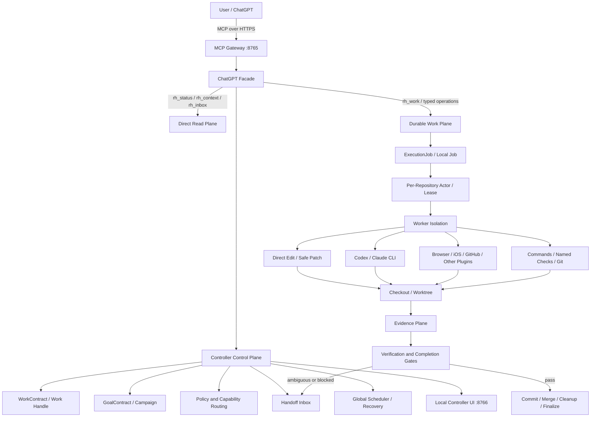

# Repo Harness + ChatGPT 当前全面架构与关键实现

> **Current Implementation Summary / 当前实现摘要**  
> 本文面向通过 ChatGPT 使用 repo-harness 的开发者，汇总系统边界、主要执行链路、持久实体、权限、证据、Git 收尾和当前已知缺口。规范性架构仍以本目录中的分主题文档为准；本文是便于理解和发布到 GitHub Wiki 的综合入口。

## 1. 基线与范围

本文依据以下仓库状态整理：

```text
Repository: moretea-labs/repo-harness-controller-runtime
Branch: main
Revision: 0eba89d88aeb698e55d42a7a7c96dda707d7f222
Package version: 1.4.0-rc.1
Observed date: 2026-07-16
```

本文同时区分三种内容：

- **当前实现**：能够由源码、持久化结构、测试或运行态直接支持的行为。
- **架构要求**：当前及后续实现应保持的边界和不变量。
- **建议收敛方向**：基于现状识别出的优化方向，不代表已经全部完成。

## 2. 产品定位

repo-harness 当前最合理的定位是：

> **ChatGPT 是交互式主控，repo-harness 是持久化执行控制面，Codex、Claude、Direct Edit 和各类插件是受控执行器。**

职责边界如下：

| 主体 | 主要职责 | 不应拥有 |
| --- | --- | --- |
| ChatGPT | 理解用户意图、划定范围、处理歧义、授权、审阅和最终判断 | 本地进程生命周期、工作区所有权、持久任务状态 |
| repo-harness | 仓库状态、任务持久化、权限、工作区、调度、证据、验证、Git 收尾和恢复 | 代替用户做模糊产品决策、假装能够主动调用当前 ChatGPT 会话 |
| Codex / Claude | 调查源码、实现修改、执行局部命令、返回证据 | 最终接受任务、推送远端、合并主线、破坏性清理 |
| Direct Edit | 对已知小范围修改进行确定性、可回滚的补丁应用 | 开放式架构探索和长期自主任务 |
| Typed Plugin | 浏览器、iOS、GitHub、App Store Connect 等领域动作 | 绕过统一权限和证据边界 |

## 3. 总体架构



完整执行遵循两条核心原则：

```text
先持久化，再执行
先验证，再完成
```

## 4. 进程与服务边界

### 4.1 MCP Gateway

MCP Gateway 是 ChatGPT 等 MCP 客户端的公共入口，负责：

- OAuth 或 bearer 身份验证；
- MCP Session Context；
- 显式仓库绑定；
- 工具 schema 和参数校验；
- 请求路由；
- 有界结果、`resultRef` 和错误分类；
- 将长执行交给 Durable Work Plane。

Gateway 不应承担：

- 长时间 Agent 生命周期；
- 重型仓库扫描；
- build/test 进程等待；
- 工作区和 worktree 的直接生命周期管理。

### 4.2 Controller Daemon

Controller Daemon 是持久控制面的主要运行进程，负责：

- 全局调度；
- 仓库注册和投影；
- Durable Job 队列；
- WorkContract、GoalContract 和 Handoff；
- Worker 健康、恢复和自愈；
- Controller Home 状态所有权。

### 4.3 Local Controller UI

本地控制台运行在 `127.0.0.1:8766`，是执行助手界面，不是公共 MCP endpoint。它通过 `src/cli/local-bridge/facade-api.ts` 复用主要 facade、WorkContract、检查、Handoff 和恢复逻辑。

## 5. ChatGPT Facade

当前首选入口为五个稳定 facade：

```text
rh_status
rh_access
rh_inbox
rh_context
rh_work
```

### 5.1 `rh_status`

主要返回：

- Controller、Gateway、Worker 和 Projection readiness；
- MCP 工具面一致性；
- 插件清单和能力分组；
- runtime source freshness；
- self-healing 诊断、dry-run 和受控修复建议。

### 5.2 `rh_access`

管理仓库级 `request` / `full_access` 模式。权限变化不改变工具 schema，也不要求重新连接 MCP。

### 5.3 `rh_inbox`

只保存真正需要 ChatGPT 或用户判断的事项，不作为普通日志列表。支持：

- list / get；
- acknowledge；
- resolve；
- dismiss；
- 保存批准后可安全重放的动作。

### 5.4 `rh_context`

提供有界上下文：

- 仓库和 checkout；
- Git 状态；
- 可用 checks；
- capability 描述；
- WorkContract 摘要；
- 最近 ExecutionJob；
- Handoff 和推荐下一步。

### 5.5 `rh_work`

统一承载主要工作流动作：

```text
start
continue
verify
repair
finalize
stop
delegate
```

其职责是选择和推进执行策略，而不是把每个底层动作都暴露为一套新的产品状态机。

## 6. FacadeResult 协议

ChatGPT-facing 返回应保持有界和可导航：

```ts
interface FacadeResult {
  status: "ok" | "blocked" | "failed" | "approval_required" | "not_found";
  summary: string;
  data: unknown;
  evidenceRefs: EvidenceRef[];
  warnings: string[];
  suggestedNextActions: SuggestedNextAction[];
  rawAvailable: boolean;
}
```

其中 `suggestedNextActions` 用于减少 ChatGPT 在大量原子工具之间自行猜测下一步的成本。每个动作应包含工具、操作、参数、风险和推荐理由。

## 7. Direct Read Plane 与 Durable Work Plane

### 7.1 Direct Read Plane

适合：

- readiness；
- Git status；
- Work/Handoff 摘要；
- checks 列表；
- plugin manifest；
- bounded context；
- evidence metadata。

要求：

- 不创建不必要的 Durable Job；
- 不等待 Worker；
- 优先读取投影和已持久化摘要；
- 缺失或陈旧时才退回 live read；
- 默认不返回完整日志和无界仓库内容。

### 7.2 Durable Work Plane

适合：

- 写文件；
- build、test、lint；
- repository command；
- Agent 执行；
- browser、simulator 和其他长任务；
- Git 写操作和远端动作。

要求：

- 使用 `requestId` 保证幂等；
- 持久化 ExecutionJob；
- 可查询、可恢复、可取消；
- 保存权限快照和仓库绑定；
- 分类基础设施失败、授权失败和验收失败；
- 结果通过 Evidence Plane 返回。

## 8. Session、仓库绑定与 Work Handle

当前执行链路是 session-aware 的：

```text
MCP Transport
  -> Session Context
     -> Repository / Checkout Binding
        -> Work Handle + WorkContract
           -> Authorization Decision
              -> Command / Edit / Git / Plugin
```

### 8.1 Session Context

记录：

- principal；
- controller instance；
- active `repoId`；
- active `checkoutId`；
- permission snapshot version；
- capability snapshot version。

切换仓库必须显式调用 `session_bind_repository`，不能根据路径或最近使用记录隐式猜测。

### 8.2 Work Handle

Work Handle 不是第二套任务生命周期。它是 WorkContract 的执行绑定，记录：

- repository；
- checkout/worktree；
- branch；
- Goal；
- principal；
- controller instance；
- permission revision；
- finalization 阶段。

该绑定保证恢复后的命令仍作用于原来的仓库和工作区。

## 9. 持久任务与执行实体

当前系统存在多个有明确用途但部分重叠的实体。

### 9.1 Issue / Task / Run

```text
Issue
  -> Task
     -> Run attempt 1
     -> Run attempt 2
```

用于正式项目账本、依赖、多次 Agent 尝试和外部 Issue 同步。Run 失败不能静默取消 Task。

### 9.2 WorkContract

WorkContract 是 ChatGPT facade 下最重要的持久工作单元，包含：

```text
objective
acceptanceCriteria
allowedPaths / forbiddenPaths
checks
constraints and accessMode snapshot
driver and worktreePolicy
evidencePolicy and recoveryPolicy
workerRef / worktreeRef
checkRefs / evidenceRefs / handoffRefs
status and continuationPrompt
```

主要状态：

```text
pending
running
blocked
waiting_for_review
succeeded
failed
cancelled
```

### 9.3 GoalContract

GoalContract 是显式自治 Goal Loop 使用的目标级状态：

```text
created -> planning -> ready -> dispatching -> running -> verifying -> finalized
                                                  |             |
                                                  |             -> repairing -> dispatching
                                                  -> waiting_for_user
                                                  -> handoff_ready
                                                  -> failed / stopped
```

每次 scheduler tick 最多推进一个有界状态转换，并管理 provider routing、retry budget、failure taxonomy、verification evidence 和 handoff packet。

### 9.4 Campaign

Campaign 是多个任务或长期工程的容器，可拥有长期 workspace、review policy、budget 和 supervisor。它适合发布治理和跨模块工程，不应成为普通小修复的默认入口。

### 9.5 ExecutionJob / Local Job

ExecutionJob 记录一次持久系统操作；Local Job 承载本地子进程执行和 stdout/stderr artifact。Job 成功仅表示该操作执行完成，不自动代表 WorkContract 满足验收。

## 10. 执行模式选择

当前 facade 将请求分为三类：

### 10.1 Direct Control

适合目标明确、文件较少、风险较低、不需要跨会话恢复的任务。

当前 `routeWorkStart()` 在该模式下主要返回 Direct Edit 建议，并不自动创建 WorkContract，也不一定立即应用修改。因此产品文案必须避免把“选择直接执行模式”误称为“代码已经开始修改”。

### 10.2 Goal Workloop

适合多步骤、需要 Worker、需要隔离 worktree、长检查或恢复的任务。它会创建 WorkContract，并允许后续 continue、verify、repair 和 finalize。

### 10.3 Handoff Only

适合需求不清、缺少授权、高风险或无法安全确定下一步的情况：

```text
不创建 WorkContract
不开始执行
创建 HandoffItem
等待 ChatGPT 或用户判断
```

## 11. 具体执行策略

### 11.1 Direct Edit / Safe Patch

用于已知、低到中风险的确定性修改。关键能力包括：

- allowed paths；
- SHA-256 stale-write 前置条件；
- revision；
- savepoint；
- create/write/replace/insert/delete patch；
- localized diff；
- rollback；
- targeted checks；
- finalize。

### 11.2 Repository Command 与 Named Check

普通命令通过统一策略层执行。验证优先使用注册的 named checks，例如：

```text
package:check:type
package:test
package:check:controller-v8
package:check:public-docs
```

这样可以减少任意 shell、命令拼接和不可重复验证。

### 11.3 Codex / Claude Worker

Agent 被定位为受控 Worker，而不是任务控制器。传入的 context pack 包含：

- objective；
- acceptance criteria；
- constraints；
- allowed/forbidden paths；
- relevant files summary；
- policy boundaries；
- existing evidence；
- expected output format。

Worker 不拥有：

- WorkContract finalize；
- remote push；
- mainline merge；
- destructive cleanup；
- secret disclosure；
- 最终验收。

### 11.4 Provider Registry 与 Goal Loop

Goal Loop 支持不同 provider 的健康检查、路由和失败回退。Provider 分为：

- 可直接调用的 executor；
- handoff-only supervisor；
- 当前不可用的 provider。

`chatgpt_handoff` 只能表示交接，repo-harness 不能在后台直接调用当前 ChatGPT 网页会话。

### 11.5 Typed Plugins

浏览器、iOS、GitHub、App Store Connect 和其他领域能力通过 manifest 和 typed action 接入。它们仍必须经过统一的 capability、policy、authorization、job 和 evidence 边界。

## 12. 权限与授权

仓库级权限模式：

```text
request
full_access
```

### 12.1 Full Access

表示对已注册仓库内普通本地开发动作自动授权，包括：

- 仓库文件修改；
- Direct Edit；
- build/test/lint；
- 本地 Git；
- worktree；
- 本地 Agent。

它不等于无限主机权限。以下动作仍然单独受控：

- remote write / push；
- destructive operation；
- 外部网络；
- 仓库外路径；
- 密钥和凭证。

### 12.2 Request

普通仓库写入需要授权，但同一 Work 可以使用 GoalDelegation 避免逐命令反复打断。

统一授权结果：

```text
allow
user_confirmation_required
deny
```

授权来源包括：

```text
policy
full_access
goal_delegation
gpt_risk_delegate
user_confirmation
```

### 12.3 权限快照

WorkContract 和 Work Handle 在创建时捕获权限 revision。之后修改仓库默认 access mode 只影响新任务，不应改变正在执行任务的权限语义。

## 13. Evidence Plane 与验证

Evidence 可以包括：

- 初始任务契约；
- edit session revision；
- diff 和 changed files；
- Worker 输出；
- check result；
- build/test artifact；
- screenshot 和其他 plugin artifact；
- commit、merge 和 cleanup 状态；
- Handoff 和失败分类。

Verification outcome 明确区分：

```text
valid_pass
valid_fail
infrastructure_failure
invalid_check_id
skipped
superseded
```

关键不变量：

> `infrastructure_failure` 不等于 `acceptance_failure`。

Controller 不可用、runtime storage 异常、Worker 丢失或 check 无法启动，不能被伪装成代码验收失败。

## 14. 完成门禁

当前实现已经拒绝仅凭 WorkContract 存在就报告成功，但变更型任务的门禁仍需进一步收紧。

当前 `hasExecutionEvidence()` 将以下任意一项视为执行证据：

```text
workerRef
worktreeRef
checkRefs.length > 0
```

这仍可能产生弱证据：创建 worktree 或运行 check 不一定证明发生了代码修改。

建议对 mutating WorkContract 强制要求至少一类 mutation evidence：

```text
edit session revision with changed files
non-empty repository diff
worker mutation manifest
committed revision
explicit no-change conclusion for investigation-only work
```

最终完成还应独立记录：

```text
validation
commit
merge
branch cleanup
worktree cleanup
WorkContract finalization
```

这些阶段不能仅由 Worker 自述替代。

## 15. Handoff Inbox

由于当前没有正式能力将后台结果主动注入原 ChatGPT 会话，repo-harness 使用持久化 Handoff Inbox：

```text
后台工作遇到阻塞或歧义
  -> 创建 HandoffItem
  -> WorkContract waiting_for_review
  -> ChatGPT 下次调用 rh_inbox / rh_context
  -> 读取证据和建议
  -> resolve / repair / verify / finalize
```

典型触发：

- acceptance failure；
- policy approval；
- destructive confirmation；
- Worker unavailable；
- Worker 输出不确定；
- repair 方向有歧义；
- self-healing 需要判断；
- merge 或最终审阅。

Handoff 不是实时推送，也不应包装成普通日志。

## 16. Review 与下一轮修复

独立 Reviewer 不是默认真理来源，也不应直接触发无界修改。推荐受控流程：

```text
Worker output
  -> Evidence
  -> Verification
  -> Optional risk-triggered review
  -> Finding triage by ChatGPT / supervisor
  -> bounded RepairInstruction
  -> repair Worker
  -> targeted re-verification
  -> finalize or handoff
```

Review finding 应至少关联：

- acceptance criterion；
- 文件或调用链；
- 可验证证据；
- severity；
- 推荐修复方向；
- 是否需要补充证据。

只有已接受的 finding 才应生成下一轮 Repair Work。建议默认最多一到两轮，并对范围扩大、需求冲突和重复争议升级到 Handoff。

## 17. Git、分支与 Worktree 生命周期

隔离任务的标准生命周期：

```text
base branch
  -> managed worktree
  -> feature branch
  -> edit / worker execution
  -> checks
  -> commit
  -> merge target branch
  -> delete feature branch
  -> remove worktree
  -> finalize WorkContract
```

`repository_git_finish_workflow` 和 `work_finalize` 用于结构化收尾。授权清理不等于清理已经成功；系统需要验证 worktree ownership、Git cleanliness、branch state 和实际删除结果。

## 18. Controller Home 与运行态存储

Controller Home 是 MCP 服务和多仓库运行态的权威位置。主要结构可概括为：

```text
controllerHome/
├── mcp/
│   ├── mcp.local.json
│   ├── mcp.tokens.json
│   ├── mcp.oauth.json
│   ├── mcp.oauth-tokens.json
│   └── mcp.runtime.json
├── repositories/
│   └── <repoId>/
│       ├── controller/
│       ├── runs/
│       ├── worktrees/
│       ├── edit-sessions/
│       ├── local-jobs/
│       ├── artifacts/
│       └── projections/
├── providers/
├── scheduler/
└── recovery/
```

仓库内旧 `.repo-harness/mcp.*` 文件仅作为兼容 fallback；仓库执行通过稳定 `repoId` 和 `checkoutId` 显式定位。

## 19. 关键实现位置

| 架构能力 | 主要实现 |
| --- | --- |
| MCP 工具定义与路由 | `src/runtime/gateway/mcp/runtime-tools.ts` |
| Local Controller facade/API | `src/cli/local-bridge/facade-api.ts` |
| WorkContract 工作循环 | `src/runtime/control-plane/facade/goal-workloop.ts` |
| WorkContract 存储 | `src/runtime/control-plane/facade/work-contract-store.ts` |
| Handoff Inbox | `src/runtime/control-plane/facade/handoff-inbox-store.ts` |
| FacadeResult | `src/runtime/control-plane/facade/facade-result.ts` |
| Capability Registry | `src/runtime/control-plane/facade/capability-registry.ts` |
| Facade Policy Gate | `src/runtime/control-plane/facade/policy-gate.ts` |
| Codex / Claude delegation | `src/runtime/control-plane/facade/codex-delegation.ts` |
| Goal Loop | `src/runtime/control-plane/goal-loop/goal-loop-engine.ts` |
| GoalContract 存储 | `src/runtime/control-plane/goal-loop/goal-contract-store.ts` |
| Provider Routing | `src/runtime/control-plane/goal-loop/executor-router.ts` |
| Provider Registry | `src/runtime/control-plane/goal-loop/provider-registry.ts` |
| Provider Dispatch | `src/runtime/control-plane/goal-loop/provider-dispatch.ts` |
| Global Scheduler | `src/runtime/control-plane/global-scheduler/scheduler.ts` |
| Session / Work Handle | `src/runtime/control-plane/execution/work-handle-store.ts` |
| Runtime Recovery | `src/runtime/recovery/` |
| Repository access mode | `src/cli/mcp/access-mode.ts` |
| Local Job store | `src/cli/local-bridge/job-store.ts` |

## 20. 当前主要架构缺口

### 20.1 Facade 还不是真正的小工具面

当前主要 facade 已存在，但 `core` 与 `advanced` 仍映射到较大的稳定 schema，原子 typed tools 继续暴露，且 transport 不支持会话内动态加载领域 schema。这会增加 MCP schema 和 ChatGPT 选工具成本。

### 20.2 `rh_work start` 的语义仍不完全等于“开始执行”

Direct Control 模式当前主要返回执行建议，可能既没有 WorkContract，也没有实际 mutation。GUI 和自然语言摘要需要明确区分：

```text
mode_selected
work_created
execution_dispatched
mutation_observed
```

### 20.3 变更型任务完成证据不足

check 或 worktree 不能替代 mutation evidence。应按 read-only、investigation 和 mutating 任务分类完成门禁。

### 20.4 多套状态模型有重叠

Issue/Task/Run、WorkContract、GoalContract、Campaign 和 ExecutionJob 都有合理用途，但普通路径不应同时要求用户理解全部概念。

### 20.5 ChatGPT 只能拉取 Handoff

后台无法直接继续当前 ChatGPT 会话。Handoff 是 durable pull model，不是实时 callback。

### 20.6 自动 Goal Loop 不应成为默认工作流

自动 provider reroute、repair 和 retry 有能力价值，但也可能造成 scope 膨胀、误修复和状态复杂度，应作为显式高级模式。

## 21. 建议收敛方向

正常工作流应收敛为：

```text
ChatGPT
  -> WorkContract
     -> Execution Strategy
        -> Evidence Gate
           -> Verify
              -> Commit / Merge / Cleanup / Finalize
                 or Handoff
```

建议优先级：

1. 对 mutating task 收紧 completion gate；
2. 让 `rh_work start` 明确区分创建、派发和真实执行；
3. 将 WorkContract 作为 ChatGPT 主路径的核心工作契约；
4. 将 GoalContract 和 Campaign 保留为显式高级能力；
5. 缩小默认 ChatGPT 工具发现面；
6. 将 commit、merge、branch cleanup 和 worktree cleanup 纳入独立可恢复阶段；
7. Review 仅按风险触发，finding 经 triage 后再生成受限 repair；
8. 保持 Repo Harness 是控制面，而不是另一个自主大模型平台。

## 22. GitHub Wiki 发布

### 22.1 当前仓库状态

截至本文基线，GitHub 仓库配置显示：

```text
has_wiki: true
repository visibility: public
current GitHub account permissions: admin / maintain / push
```

但 Wiki Git remote：

```text
https://github.com/moretea-labs/repo-harness-controller-runtime.wiki.git
```

当前返回 `Repository not found`。这通常表示 Wiki 功能已启用，但尚未在 GitHub 网页创建第一张 Wiki 页面，因此独立 `.wiki.git` 仓库还没有初始化。

### 22.2 推荐发布方式

1. 在 GitHub 仓库的 Wiki 页面创建第一张 `Home` 页面；
2. 初始化后 clone `.wiki.git`；
3. 将本文复制为 `Repo-Harness-Current-Architecture.md`；
4. 在 `Home.md` 中链接该页面；
5. commit 并 push Wiki 仓库。

示例：

```bash
git clone https://github.com/moretea-labs/repo-harness-controller-runtime.wiki.git /tmp/repo-harness-wiki
cp docs/architecture/current/chatgpt-repo-harness-current-architecture.zh-CN.md \
  /tmp/repo-harness-wiki/Repo-Harness-Current-Architecture.md
cd /tmp/repo-harness-wiki
git add Repo-Harness-Current-Architecture.md
git commit -m "docs: publish current repo-harness architecture"
git push
```

### 22.3 权威来源规则

GitHub Wiki 建议作为阅读镜像，而不是新的规范来源：

- 本目录继续作为 Runtime Authority；
- Wiki 页面顶部注明对应仓库 revision；
- 架构修改先合并到主仓库，再同步 Wiki；
- 不在 Wiki 单独维护与源码仓库不同的架构结论；
- 后续可增加脚本或 CI，从 canonical Markdown 单向同步到 Wiki。

## 23. 相关规范文档

进一步阅读：

- [`system-overview.md`](system-overview.md)
- [`architecture-invariants.md`](architecture-invariants.md)
- [`entity-model.md`](entity-model.md)
- [`job-and-run-lifecycle.md`](job-and-run-lifecycle.md)
- [`dispatch-and-agent-strategy.md`](dispatch-and-agent-strategy.md)
- [`session-aware-execution-and-authorization.md`](session-aware-execution-and-authorization.md)
- [`repository-access-modes.md`](repository-access-modes.md)
- [`verification-and-release-gates.md`](verification-and-release-gates.md)
- [`runtime-directory-map.md`](runtime-directory-map.md)
- [`implementation-status.md`](implementation-status.md)
