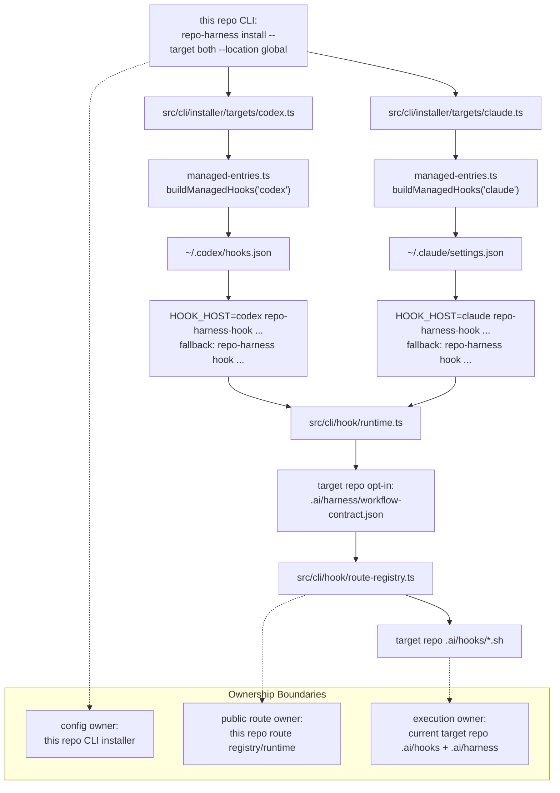

# Architecture Module: runtime-harness/hook-adapters

> **Capability ID**: `runtime-harness-hook-adapters`
> **Matched Prefixes**: `assets/hooks`, `.ai/hooks`, `src/cli/installer`, `src/cli/hook`, `src/cli/hook-entry.ts`, `scripts/run-skill-hook.ts`
> **Local Contracts**: `AGENTS.md`, `CLAUDE.md`

## P1 Map

The hook adapter layer connects agent tool events to the repo-local workflow
contract.

Authoritative split:

- `assets/hooks/`: installable shared hook source.
- `.ai/hooks/`: self-host runtime hook implementation.
- `.ai/harness/scripts/`: installed workflow helper runtime for generated and
  downstream repos. This is not a hook route implementation surface; the
  self-host repo keeps source helpers under root `scripts/`.
- `src/cli/installer/targets/*`: user-level adapter writers for `~/.claude/settings.json` and `~/.codex/hooks.json`.
- `src/cli/hook/*`: public route registry and compatibility runtime bridge.
- `src/cli/hook-entry.ts`: minimal hook-only entrypoint that checks repo opt-in and dispatches ordered `.ai/hooks/*` scripts without loading the full CLI.
- `src/cli/commands/security.ts`: read-only security scan for user-level hook config and VS Code folder-open task injection surfaces.
- Repo-local `.claude/settings.json` and `.codex/hooks.json`: retired legacy project-level adapters cleaned by migration.
- Repo-local `.codex/*`: ignored Codex runtime residue.
- Codex Settings trust state: user-controlled runtime approval required before Codex executes `~/.codex/hooks.json`.
- `scripts/run-skill-hook.ts`: skill lifecycle hook runner for pre/post migration events.

Runtime state is stored under ignored `.ai/harness/*` paths and `.claude` runtime
files. It is not a product deliverable.

## P2 Trace

Concrete route: Claude or Codex `PreToolUse` for edit/write -> host adapter
runs `repo-harness-hook` from user-level config -> hook entry checks the current repo's
`.ai/harness/workflow-contract.json` opt-in marker -> route registry selects
the ordered scripts -> invokes `worktree-guard.sh` and `pre-edit-guard.sh`
-> guards inspect policy, active plan state, protected paths, and task workflow
expectations -> warning or block is returned to the agent.
After adapter configuration, Codex still requires the user to trust
`~/.codex/hooks.json` in Codex Settings before that route executes.

Subagent return route: Claude `PreToolUse` for `Task|Agent|SendUserMessage`
uses the `subagent` route and runs `subagent-return-channel-guard.sh`. For
spawns, the guard appends a return-channel contract to the prompt through
`updatedInput`. For spawned subagent `SendUserMessage` calls, the guard denies
delivery because subagent final text is the only payload returned to the caller.
Missing copies of this route are soft-skipped so older repo-pinned hook runtimes
do not break subagent creation before a hook refresh.

Post-edit route: edit/write -> `post-edit-guard.sh` -> architecture-sensitive
paths call `architecture-queue.sh` -> capability resolver binds the changed file
to a capability -> pending request is written under `docs/architecture/requests`
and an event is appended under `.ai/harness/architecture/events.jsonl`.

Session-start security route: `SessionStart.default` runs
`session-start-context.sh` and then `security-sentinel.sh` under the same
adapter entry. The runtime aggregates SessionStart stdout from ordered scripts
into one `additionalContext` JSON payload, so adding the sentinel does not
create a new Codex trust entry or emit invalid multiple JSON documents.

Error paths:

- Hook input parsing falls back across stdin JSON, env, and argv compatibility.
- Worktree guard warns by default and blocks only when marker policy is enabled.
- Runtime write failures should produce structured warnings or failure logs without corrupting the repo contract.

## Semantic Diagram

### Complete Hook Workflow

```mermaid
flowchart TD
  subgraph Install["Adapter Install / Migration"]
    Init["repo-harness init/install"] --> Targets["installer targets: codex.ts / claude.ts"]
    Targets --> Managed["managed-entries.ts: buildManagedHooks()"]
    Managed --> Registry["route-registry.ts: ROUTES"]
    Managed --> CodexCfg["~/.codex/hooks.json user-level"]
    Managed --> ClaudeCfg["~/.claude/settings.json or .claude/settings.json"]
    CodexCfg --> Trust["Codex Settings trust hash"]
  end

  subgraph Host["Host Event"]
    ClaudeCfg --> Event["Claude/Codex hook event"]
    Trust --> Event
    Event --> Match{"event + matcher"}
    Match --> Cmd["HOOK_HOST=host repo-harness-hook EVENT --route ROUTE_ID<br/>fallback: repo-harness hook"]
  end

  subgraph Dispatch["Runtime Dispatch"]
    Cmd --> Entry{"minimal bin available?"}
    Entry -->|yes| HookEntry["src/cli/hook-entry.ts"]
    Entry -->|fallback| FullCli["src/cli/commands/hook.ts"]
    HookEntry --> Runtime["src/cli/hook/runtime.ts: runHook()"]
    FullCli --> Runtime
    Runtime --> Git{"inside git repo?"}
    Git -->|no| Exit0A["exit 0 silently"]
    Git -->|yes| OptIn{".ai/harness/workflow-contract.json exists?"}
    OptIn -->|no| Exit0B["exit 0 non-opt-in"]
    OptIn -->|yes| Route{"getRoute(event, route)"}
    Route -->|unknown| Exit2["exit 2 unknown route"]
    Route -->|ok| Spawn["spawn bash .ai/hooks/SCRIPT<br/>set HOOK_REPO_ROOT"]
    Spawn --> Quiet{"HOOK_HOST=codex and event != SessionStart?"}
    Quiet -->|Stop decision JSON| StopDecision["forward decision JSON<br/>suppress success stderr"]
    Quiet -->|other success stdout| QuietStdout["stdout piped/emptied on success<br/>failure stdout moved to stderr"]
    Quiet -->|no| Inherit["stdio inherited"]
  end

  subgraph Routes["Public Route Registry"]
    Route --> SS["SessionStart.default"]
    SS --> SSC["session-start-context.sh"]
    SSC --> SecuritySentinel["security-sentinel.sh<br/>changed-only config scan"]

    Route --> PreEdit["PreToolUse.edit<br/>matcher: Edit|Write"]
    PreEdit --> Worktree["worktree-guard.sh"]
    Worktree --> PreGuard["pre-edit-guard.sh"]

    Route --> PreSubagent["PreToolUse.subagent<br/>matcher: Task|Agent|SendUserMessage"]
    PreSubagent --> SubagentGuard["subagent-return-channel-guard.sh<br/>final-text return-channel guard"]

    Route --> PostEdit["PostToolUse.edit<br/>matcher: Edit|Write"]
    PostEdit --> PostGuard["post-edit-guard.sh"]

    Route --> PostBashRoute["PostToolUse.bash<br/>matcher: Bash"]
    PostBashRoute --> PostBash["post-bash.sh"]

    Route --> Always["PostToolUse.always<br/>all tools"]
    Always --> Observer["post-tool-observer.sh<br/>trace + lightweight advisories"]

    Route --> Prompt["UserPromptSubmit.default"]
    Prompt --> PromptGuard["prompt-guard.sh"]

    Route --> Stop["Stop.default"]
    Stop --> StopOrchestrator["stop-orchestrator.sh"]
  end

  subgraph Shared["Shared Hook Libraries"]
    Input["hook-input.sh<br/>stdin/env/argv parser"]
    Workflow["lib/workflow-state.sh<br/>active plan, pending plan, todo, contract, handoff, events"]
    Session["lib/session-state.sh<br/>session keys and route state"]
  end

  SSC -. uses .-> Input
  SSC -. uses .-> Workflow
  PreGuard -. uses .-> Input
  PreGuard -. uses .-> Workflow
  SubagentGuard -. uses .-> Input
  PostGuard -. uses .-> Input
  PostGuard -. uses .-> Workflow
  PostBash -. uses .-> Input
  PostBash -. uses .-> Workflow
  Observer -. uses .-> Input
  Observer -. uses .-> Session
  Observer -. uses .-> Workflow
  PromptGuard -. uses .-> Input
  PromptGuard -. uses .-> Workflow
  StopOrchestrator -. uses .-> Input
  StopOrchestrator -. uses .-> Workflow

  subgraph Effects["Side Effects / Outputs"]
    SSC --> AddCtx["SessionStart additionalContext JSON"]
    SecuritySentinel --> SecurityCtx["security scan -> .ai/harness/security/latest.json<br/>optional SessionStart reminder"]
    PreGuard --> Block["guards: _ref, _ops, deploy, scope, plan transition, test/spec-first"]
    SubagentGuard --> ReturnChannel["Task/Agent prompt contract<br/>subagent SendUserMessage deny"]
    PostGuard --> Verify["verify-contract --quiet -> .ai/harness/checks/latest.json"]
    PostGuard --> Drift["architecture-queue.sh -> docs/architecture/requests + events.jsonl"]
    Drift --> ContextSync["context-contract-sync or capability-context request"]
    PostGuard --> Handoff[".claude/.task-handoff.md + .ai/harness/handoff/current.md"]
    PostBash --> Checks["Bash result/check evidence"]
    Observer --> TraceLog[".claude/.trace.jsonl"]
    PromptGuard --> PlanGate["plan start/capture/execution/done/archive gates"]
    PromptGuard --> Hints["Waza / CodeGraph / CrossReview / TDD / BDD hints"]
    StopOrchestrator --> StopHandoff["workflow_write_handoff(session-stop)"]
    StopOrchestrator --> Completeness["one-shot pending plan completeness Stop block"]
  end

  subgraph Compat["Legacy / Template Compatibility"]
    Templates["assets/hooks/*.template.json"] --> RunHook[".ai/hooks/run-hook.sh"]
    RunHook --> Spawn
  end
```

### User-Level Adapter Ownership

## P3 Decision

The shared `.ai/hooks` layer exists to avoid maintaining separate Claude and
Codex hook implementations. The invariant is single implementation, adapter-only
host config. The adapter now lives at user level so new repos only opt in by
carrying repo-local workflow contract files and hook implementation.

At 10x hook events, the first failure is cold-loading the full CLI on every
hook event. The invariant is that host adapters point at the minimal
hook-only entrypoint and then `.ai/hooks`, instead of creating separate
per-host implementation trees or loading non-hook command modules.

## 2026-06-12 Architecture Queue Closeout

- Post-edit architecture drift recording now runs through
  `scripts/architecture-queue.sh record`; `.ai/hooks/post-edit-guard.sh` and
  `assets/hooks/post-edit-guard.sh` preserve the existing
  `[ArchitectureDrift] Request:` stdout prefix so context sync and capability
  context queuing remain advisory hook side effects.
- The queue writes one pending card per capability and relies on
  `scripts/architecture-event.ts` for card rendering and derived index
  rewriting, removing the previous append-to-index state machine from the hook
  hot path.
- PostToolUse remains warning-only: hard blocking belongs to explicit checks and
  finish gates, not to edit-time hook execution.

## 2026-06-13 Runtime Isolation Closeout

- The PRD/Sprint catalog split does not add a hook adapter route. SessionStart
  may project the active Sprint pointer from `plans/sprints/*.sprint.md`, but
  Sprint expansion and plan capture remain workflow-helper behavior.
- Generated and downstream repos install repo-harness workflow helpers under
  `.ai/harness/scripts/` to avoid colliding with app-owned root `scripts/`.
  Hook route scripts remain under `.ai/hooks/`.
- The self-host source repo keeps root `scripts/` as the product source for
  helper implementations. Migration cleanup preserves those source helpers and
  only removes downstream root helpers when repo-harness ownership is
  identifiable.
- The pending request for `.ai/hooks/post-tool-observer.sh` did not correspond
  to an open route or observer implementation diff in this closeout. No new
  hook adapter entrypoint, dependency boundary, or runtime route was introduced.

## Optimization Backlog

- Keep `repo-harness init` and migration from regenerating repo-local `.claude/settings.json` / `.codex/hooks.json` adapters.
- Remind users to trust `~/.codex/hooks.json` in Codex Settings after user-level adapter installation.
- Keep hook asset parity test coverage whenever `.ai/hooks` or `assets/hooks` changes.
