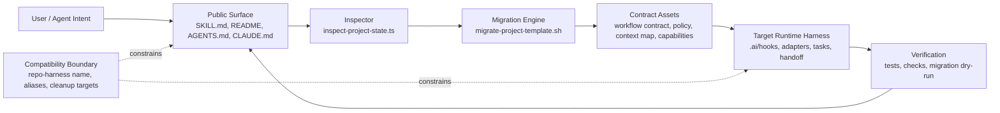

# Architecture Snapshot: repo-harness Plugin Review

> **Date**: 2026-05-25
> **Scope**: Whole plugin architecture, architecture ledger backfill, and optimization backlog.
> **Verification Snapshot**: `inspect-project-state` OK, `check-task-workflow --strict` OK, `bun test` 311 pass / 6 skip / 0 fail before docs backfill.

## P1 Map

`repo-harness` self-hosts a file-backed workflow harness. The repo has 356 files.
The largest risk-bearing surfaces are `scripts/lib/project-init-lib.sh` at about
1,879 lines and `scripts/migrate-project-template.sh` at about 901 lines. The
engine is healthy, but the architecture ledger was stale: only `docs/architecture/index.md`
and a legacy `project-initializer` diagram existed, while domains/modules and
capability registry ownership were empty.

System components:

- Public surface: `SKILL.md`, `README.md`, root `AGENTS.md` / `CLAUDE.md`, `assets/skill-commands/*`.
- Workflow engine: inspector, migrator, scaffold/install scripts, shared shell library.
- Contract assets: workflow contract, policy, context map, capability registry, templates, reference configs.
- Runtime harness: `.ai/hooks`, `assets/hooks`, `.claude/settings.json`, runtime `.ai/harness/*` state.
- Verification: `tests`, `evals`, helper checks, migration dry-run, installed-copy sync tests.

Out of scope:

- Runtime product behavior in generated apps.
- External tool installation or upgrades.
- `_ref/` and `_ops/` content.

## P2 Trace

Main route traced:

```text
User intent
  -> root SKILL.md / action command facade
  -> scripts/inspect-project-state.ts
  -> scripts/migrate-project-template.sh
  -> scripts/migrate-workflow-docs.ts when legacy docs exist
  -> assets/workflow-contract.v1.json copied to .ai/harness/workflow-contract.json
  -> .ai/harness/policy.json + .ai/context/context-map.json + .ai/context/capabilities.json
  -> .ai/hooks + .claude/settings.json adapter
  -> scripts/check-task-workflow.sh --strict
```

## Semantic Diagram



The input source of truth is the target repo filesystem. The first contract
crossing is repo state to structured inspection fields: `mode`,
`legacy_contract_version`, `drift_signals`, `required_decisions`, and
`upgrade_plan`. The second crossing is contract asset to installed runtime
manifest and policy files. The final side effect is a verified repo-local
workflow harness.

Exceptional paths:

- Legacy docs are archived or normalized before template refresh.
- Stale generated hook shims and retired Skill Factory files are removed only
when listed as `known_generated`.
- User-authored custom hooks, `_ref/`, `_ops/`, secrets, local env, and advisory
tooling state are preserved.

## P3 Decision

The current design exists because a repo-local agent workflow needs durable
state, predictable context, and verification without depending on a live service.
The non-obvious design decision is to keep root prompt files short while moving
behavior into machine-readable manifests, scripts, and tests.

Invariant to preserve:

- File-backed contracts are authoritative.
- Hooks enforce workflow shape but do not own architecture semantics.
- External tooling is advisory unless the user explicitly requests tooling maintenance.
- Generated and self-hosted behavior must move together.

10x scale pressure:

- More commands will stress command discoverability first.
- More generated repo variants will stress shell idempotency and helper-list drift.
- More hook adapters will stress single-source `.ai/hooks` ownership.
- More architecture modules will need registry validation in strict workflow checks.

Chosen implementation:

Backfill docs and capability registry first. This is the smallest coherent
change because engine checks are already green; changing engine behavior before
documenting ownership would increase blast radius without addressing the current
weakest point.

## Optimization Backlog

1. Treat repo-local `.codex/` as local/untracked residue unless official Codex repo-local config support is verified; keep repo-local implementation under `.ai/`.
2. Add capability registry validation to `check-task-workflow.sh --strict` after the registry survives another real architecture edit.
3. Continue reducing duplicated helper inventories across shell scripts by routing new required paths through `assets/workflow-contract.v1.json`.
4. Keep optional reference docs externalized; do not re-grow default generated docs.
