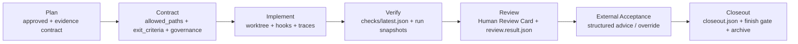
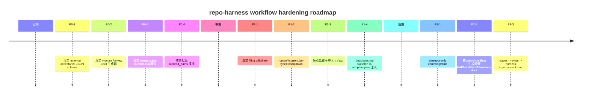

# repo-harness Plan to Closeout 工作流对标报告

## 执行摘要

repo-harness 的 **Plan → Contract → Worktree → Verify → Review → External Acceptance → Closeout** 主线，已经非常接近当下领先 agent engineering harness 的共识做法：把“聊天记忆”替换成“仓库内可审计工件”，把实施权限收敛到 contract，把完成定义收敛到 checks/review/evidence，再通过 handoff 和 worktree 保持长时任务可续跑。它的强项尤其体现在：**文件化状态**、**machine-readable policy**、**contract 级 allowed_paths**、**finish 阶段外部验收门禁**、以及 **migration/consistency scripts** 这几块，和 Anthropic 关于长时代理 harness 的“清晰工件 + clean state + incremental progress”、OpenAI 关于“traces + evals + handoffs + approvals”、以及 GitHub/Jules 关于“plan approval / PR gating / admin governance”的公开模式高度同向。citeturn7view2turn21view3turn21view4turn19view4turn15view7turn15view8turn10view0turn11search0turn26view0turn32view2turn31view11

但 repo-harness 也暴露出几个关键优化点。最重要的不是“再加更多流程”，而是把现有流程 **分层、结构化、减歧义**：其一，`docs/spec.md` 当前几乎是占位符，导致高层产品意图没有被充分外化给 Agent；其二，`contract.template.md` 与 `review.template.md` 已经拥有大量信息，但 **机器消费** 和 **人类评审** 仍混在同一 Markdown 表面上，容易造成解析脆弱和 reviewer 负担；其三，默认 `allowed_paths` 仍偏宽，`src/`/`tests/` 级别的目录开放更像“宽边界工程实践”，还没进化到“最小可写面”策略；其四，external acceptance 虽然已经是 finish gate 的硬条件之一，但状态仍主要依赖 Markdown 章节解析，缺少一个稳定、可 lint、可签名、可追溯的结构化 acceptance contract。citeturn33view0turn34view1turn34view2turn31view2turn32view6turn32view8turn31view11turn30view2turn30view3turn30view5

从“文档与 filing 是否符合人机交互”的角度看，repo-harness 当前最成熟、最适合 Agent 消费的表面是：`AGENTS.md`、`.ai/harness/policy.json`、`tasks/current.md`、`tasks/todos.md`、`capture-plan.sh` 生成的 `## Evidence Contract`、以及 contract/review/checks 组合。这些文件已经在做“把开发上下文外化给 agent”这件事。相反，`review.template.md` 更偏 **human review artifact**，而 `docs/spec.md` 本来应当承担“稳定使命/产品意图”职责，却目前没有真正提供可执行上下文，因此它既没有服务好 Agent，也没有服务好人类 reviewer。`document-generation.md` 的原则本身是对的——短文档、写清 owner/source/verification，不要重复规则——但当前主规格文件还没有把这些原则落地。citeturn30view11turn40view2turn30view7turn30view9turn32view2turn33view0turn34view1turn30view3turn30view5

因此，本报告的核心判断是：**repo-harness 不需要大改流程顺序，而需要把现有流程升级成“双通道工件体系”**。也就是：一条通道服务机器门禁与自动化验证，另一条通道服务人类 reviewer 的快速判断；同时用更严格的 policy / linter / schema 把两者绑定起来，减少 filing drift。Anthropic、OpenAI、GitHub、Google Jules、以及 Agentless / AutoCodeRover / SWE-agent 这条线的经验都说明，可靠性不是来自更复杂的框架，而是来自 **明确的 ownership、结构化 handoff、可重跑的验证、以及小而稳定的接口契约**。citeturn7view0turn7view3turn19view2turn20view7turn15view8turn15view9turn10view4turn11search0turn13search12turn13search7turn12search15

## 跨组织模式比较

下表按你要求的维度，归纳 Anthropic、OpenAI 与其他代表性体系在 harness / agent engineering 上的公开模式。若官方来源未明确说明，我标记为“未明确说明”。

| 模式 | Anthropic | OpenAI | 其他代表例子 | 说明 |
|---|---|---|---|---|
| 治理模型 | 强调 **simple, composable patterns**，并把人类监督视为高价值 agent 场景中的必要条件；自动模式通过分类器/权限边界约束危险动作。citeturn7view0turn21view6 | 明确把 **guardrails** 和 **human review** 视为 run 是否继续/暂停/停止的治理层；Codex 还支持 enterprise-managed requirements、hooks、review policy。citeturn19view4turn14view4turn15view4 | GitHub Copilot cloud agent 由组织/企业策略启用，Jules API 支持 `requirePlanApproval`。citeturn10view5turn11search0 | repo-harness 已有 policy 与 finish gate，但“谁批准计划、谁批准 closeout、谁可 override”尚未形成清晰 machine-readable 治理角色层。 |
| 证据与退出标准格式 | 长时 harness 的核心是 `init.sh`、`claude-progress.txt`、git 历史、incremental progress、clean state；评估用于让行为变化可见。citeturn21view0turn21view1turn21view3turn21view5 | OpenAI Cookbook 明确把 harness 定义为 instructions、tools、routing、output requirements、validation checks 的总契约；评审/修复/验证三段式用结构化输出闭环。citeturn20view7turn19view2 | Agentless 把问题拆成 localization / repair / patch validation；AutoCodeRover 强调结构感知搜索与程序改进。citeturn13search12turn13search7 | repo-harness 已有 contract 中 `exit_criteria`、review scorecard、checks snapshots，但仍偏 Markdown-first，结构化层不足。 |
| 机器可读政策文件 | 公开资料有 hooks、settings、subagents/frontmatter、sandbox 配置，但“统一企业策略文件”未在本次主要 Anthropic 源中系统描述。部分维度未明确说明。citeturn2view1turn5view5turn22view1 | `requirements.toml`、`config.toml`、`guardian_policy_config`、managed hooks、permission profiles 都是明确的一等配置面。citeturn14view4turn14view5turn15view4turn15view6 | Jules 会话 schema 是 JSON；GitHub custom instructions 主要是 Markdown，不算严格 machine-readable policy。citeturn11search0turn10view2 | 这是 repo-harness 的强项之一：`.ai/harness/policy.json` 已经是成熟方向。 |
| handoff protocol | Anthropic 长时 harness 依赖 progress file + git history + 留下清晰工件；研究系统里要求子代理拿到明确 objective / output format / source guidance / boundaries。citeturn21view2turn7view4 | Agents SDK 有 handoffs；Codex app 有 Local↔Worktree Handoff；sessions 支持 durable memory / resumable approval flows。citeturn15view8turn15view3turn15view9 | GitHub 会在 chat 和 cloud-agent session 之间共享上下文；Jules 会话有明确 state 机。citeturn10view0turn11search0 | repo-harness 已有 `handoff/current.md` 与 `resume.md`，但缺少单独的 typed handoff schema。 |
| worktree / branch gating | Anthropic 公开材料提到 parallel / long-running agent patterns，但在本次主来源里没有像 Codex 那样把 git worktree 作为一等官方治理对象详细展开；此维度官方细节相对未明确。citeturn6search20turn7view2 | Codex 明确把 worktree 作为并行任务隔离面，并通过 Handoff 安全地在 Local 和 Worktree 间移动线程。citeturn15view0turn15view3turn15view2 | GitHub cloud agent 在分支上工作并开 PR；Jules 支持 `startingBranch` 与自动建 PR。citeturn10view0turn10view1turn11search0 | repo-harness 非常接近 OpenAI/Codex 这一类最佳实践。 |
| review template / Human Review Card | 未明确说明官方标准 review card 模板。 | 有 human review/approvals 概念，但未见固定“Human Review Card”模板；Cookbook 更像 workflow 示例。citeturn19view4turn18search2 | GitHub 有 PR review、AI review、PR summary，且 Copilot PR 审核不计入必需批准数。citeturn10view4turn9search20 | repo-harness 已有 `review.template.md`，但还不是一个 reviewer 快速决策型 card。 |
| `allowed_paths` / 最小权限写面 | Anthropic 安全重点在 filesystem + network isolation；subagent 也有 tools/disallowedTools。citeturn22view1turn5view5 | OpenAI 以 permission profiles、sandbox modes、`writable_roots`、prefix rules 等控制边界。citeturn15view6turn17search1 | GitHub path-specific review instructions 存在，但不是写权限面。citeturn10view2 | repo-harness 已有 contract `allowed_paths`，但默认粒度偏粗。 |
| closeout-only 模板 | 未明确说明。 | 未明确说明。 | 未明确说明。 | 这是 repo-harness 可差异化补强的方向。 |
| migration / filing drift lint | Anthropic 强调 harness 假设会过时，但未在本次主来源里给出文档 drift linter 方案。citeturn7view5 | Codex 有 migrate to Codex flows、managed config、配置迁移与导入，但不是 repository filing drift lint 的完整公开方案。citeturn17search2turn8search8 | GitHub/Jules 官方来源中未见通用 drift linter。 | repo-harness 反而已经领先：有 `check-task-workflow.sh`、`check-task-sync.sh`、`migrate-project-template.sh`。 |
| external acceptance gating | Anthropic 强调 meaningful human oversight，但“外部验收工件”未明确模板化。citeturn7view0 | OpenAI 把 approvals 定义为敏感动作的暂停点；auto-review 还会 fail closed，但没有“外部验收”专属模板。citeturn19view4turn17search1 | GitHub 强调 PR 需要真人 reviewer；Jules 有 plan approval。citeturn10view4turn11search0 | repo-harness 的 External Acceptance Advice 已经比很多公开框架更显式，但还缺 typed schema。 |
| spec / mission docs | Anthropic 更强调 context engineering，与 repo spec 文件约定无强绑定。citeturn7view1 | OpenAI 官方提出 `AGENTS.md` 与 `PLANS.md`/ExecPlan 作为仓库内长期任务规格面。citeturn20view0turn20view2turn20view4 | GitHub 用 repository custom instructions；Jules session prompt 也是高层入口。citeturn10view2turn11search0 | repo-harness 已有 `AGENTS.md` 与 `docs/spec.md` 约定位，但 spec 内容仍明显不足。 |
| tooling / scripts integration | Anthropic Agent SDK、MCP、hooks、subagents 都是程序化入口；强调工具描述质量。citeturn6search4turn7view4turn16search8 | Codex CLI 可作为 MCP server；Tracing、Evals、repair loops 进入同一工程化闭环。citeturn19view1turn15view7turn20view10 | GitHub cloud agent 跑在 Actions powered 环境；Jules API 可嵌入 Slack/Linear/GitHub；Gemini CLI 基于 ReAct + MCP。citeturn10view0turn10view6turn10view7 | repo-harness 强项是 shell/CLI 很齐，但 eval 与 reviewer-facing structured outputs 还可以再产品化。 |
| security / safety gates | Anthropic 公开了 prompt-injection probe、transcript classifier、filesystem/network isolation，并强调把 blast radius 封在边界里。citeturn21view6turn22view1turn21view10 | OpenAI 有 auto-review 阻断数据外泄/凭证探测/持久性削弱/破坏性动作，且 managed hooks 可 fail closed。citeturn17search1turn15view4 | GitHub 明示要审查 `.github/workflows/` 变更再跑 Actions；OpenHands 强调 Docker sandbox。citeturn10view4turn12search10 | repo-harness 目前已有 config security scan 与 hook authority map，但还可以增加对“敏感路径变更”的强制人工门禁。 |

从横向比较看，repo-harness 的总体方向其实并不落后；它真正缺的不是“有没有这些部件”，而是 **把部件之间的责任边界再清楚一层**。Anthropic 和 OpenAI 的公开材料都在不断强调：可靠 agent 系统的关键不是巨型复杂 orchestrator，而是 **稳定接口、简洁工件、可验证闭环、可恢复状态**。repo-harness 当前已经具备这些要素，只是还没有把“agent-facing contract”和“human-facing review decision surface”完全拆开。citeturn7view0turn7view5turn19view2turn20view7turn20view10

## repo-harness 映射与差距

### 对现有 Plan to Closeout 流程的映射

下表把跨组织模式映射到 repo-harness 当前文件/脚本表面，并指出主要差距。

| 模式 | repo-harness 当前实现 | 主要差距 |
|---|---|---|
| 文件化治理与标准入口 | `AGENTS.md` 定义 canonical workflow files；README 把系统边界描述为“repo-local workflow state, not chat memory”。citeturn30view11turn26view0 | `AGENTS.md` 负责面较多，但和 `docs/reference-configs/*.md`、`policy.json` 之间仍可能出现重复或漂移。 |
| 计划批准后才能执行 | `plan-to-todo.sh` 在提取前硬检查 plan 必须是 `Approved`，且 Evidence Contract 完整。citeturn31view0turn31view1 | 缺少更细的 governance：谁批准、批准来源、是否允许基于 reviewer override 进入执行，没有统一 schema。 |
| Evidence Contract | `capture-plan.sh` 会生成 `## Evidence Contract`，包括 state/progress path、verification evidence；contract 模板有 machine-verifiable `exit_criteria`。citeturn32view2turn33view0 | 计划级、合同级、closeout 级证据仍未分层；没有 closeout-only contract / final attestation。 |
| 机器可读 policy | `.ai/harness/policy.json` 覆盖 checks/handoff/evidence lifecycle/profiles/worktree strategy/external tooling。citeturn40view1turn40view2turn40view4 | 缺少 reviewer card schema、external acceptance schema、governance roles schema。 |
| handoff 与 resume | `policy.json` 里有 `.ai/harness/handoff/current.md`、`resume.md` 和 `~/.codex/handoffs`；`tasks/current.md` 是可追踪 snapshot。citeturn40view1turn30view7 | handoff 仍主要是 Markdown，缺少稳定 JSON 字段供自动接力与 lint。 |
| worktree/branch gating | `policy.json.worktree_strategy` 有 `auto_for_contract_tasks`、`branch_prefix: codex/`；`contract-worktree.sh` 会校验 changed path 是否超出 contract `allowed_paths`。citeturn29view7turn32view8 | enforcement 当前是 `worktree_guard: warn-by-default`；对高风险变更可进一步收紧。 |
| 审核模板 | `.claude/templates/review.template.md` 已经有 Verification Evidence、External Acceptance Advice、Scorecard、Retest Steps、Summary。citeturn34view1turn34view2turn34view5 | 这是完整 review 模板，但不是“5 秒看完即可决策”的 Human Review Card。 |
| 允许修改范围 | contract 模板有 `allowed_paths`，并支持 delegation budget / permission_scope。citeturn33view0turn31view2 | 默认模板把 `src/`、`tests/`、`plans/` 整段开放；应切到更窄的 capability/file-prefix 粒度。 |
| verify / checks | `verify-contract.sh` 检查 `files_exist`、`artifacts_exist`、`qa_scores` 等；`verify-sprint.sh` 产出 `.ai/harness/checks/latest.json` 和 run snapshot。citeturn31view8turn31view9turn31view6 | review recommendation、external acceptance 仍主要从 Markdown 解析；没有 typed verifier summary。 |
| external acceptance | review 模板有 `## External Acceptance Advice`；`contract-worktree.sh finish` 会在 external acceptance 不为 `pass`/`manual_override` 时拒绝 closeout。citeturn34view1turn32view6 | 这个门禁方向很强，但状态枚举、审阅人、来源、override 原因仍缺 JSON/YAML 伴随工件。 |
| filing / drift 检查 | `check-task-workflow.sh --strict`、`check-task-sync.sh`、`migrate-project-template.sh --dry-run` 已经构成 workflow drift 防线。citeturn36view0turn36view2turn36view4 | 目前更偏“文件在不在/关系对不对”，还缺“文档是不是只有占位/字段是否空洞/规则是否重复”的质量 linter。 |
| stable mission/spec docs | `policy.json` 把 `docs/spec.md` 列为 required；`document-generation.md` 要求文档简短、注明 owner/source/verification。citeturn29view8turn30view3turn30view5 | `docs/spec.md` 当前只有标题和 `Status: Draft Owner: Planner`，几乎是空白表面。citeturn30view2 |
| tooling readiness | `check-agent-tooling.sh --host codex --strict-readiness` 被 policy 作为 readiness gate 引用。citeturn40view4turn36view7 | tooling readiness 已被纳入，但和 task closeout 的证据链没有统一到单一 reviewer card。 |
| 安全门禁 | README/CHANGELOG 说明有 `repo-harness security scan`、security sentinel、central-first hook authority。citeturn37search1turn28search2turn26view0 | 仍缺针对敏感路径改动的“自动要求人审 + 禁止自动 closeout”规则。 |

### 哪些文档更偏 Agent 外化上下文

更适合 **Agent 读取与执行** 的表面，主要是这些：

`AGENTS.md` 负责说明 canonical workflow files 与操作规则；`.ai/harness/policy.json` 负责 machine-readable contract；`tasks/current.md` 提供当前状态快照但明确说明“不是 live lock / kanban / implementation gate”；`tasks/todos.md` 明确自己只是 deferred-goal ledger，不应重复 active plan checklist；`capture-plan.sh` 与 `plan-to-todo.sh` 则把 Plan 转成可执行 contract/review/notes/checks surface。它们共同形成了“外部化给 Agent 的开发上下文”。citeturn30view11turn40view1turn40view2turn30view7turn30view9turn32view2turn31view0turn31view4

这种设计与 Anthropic 对长时任务“progress file + git history + incremental progress + clear artifacts”的做法，以及 OpenAI 对 `AGENTS.md`/`PLANS.md`、handoff、structured validation 的做法非常一致：**下一次会话不应重新理解一切，而应接管上一轮留下的、足够清晰的工件**。repo-harness 在这点上已经走在对的路上。citeturn21view0turn21view1turn21view3turn20view0turn15view8turn15view9

### 哪些文档更偏人类评审

更偏 **human review** 的表面，则是 `tasks/reviews/*.review.md`、contract 模板中的 Acceptance Notes / Rollback Point、以及最终 sprint review recommendation。尤其 review template 已经有 Verification Evidence、External Acceptance Advice、Behavior Diff、Residual Risks、Scorecard、Retest Steps，这些是非常典型的人类 reviewer 决策界面。`verify-sprint.sh` 甚至明确把 `Recommendation: pass` 作为 closeout 判断的一部分。citeturn34view1turn34view2turn34view5turn31view7

问题在于：这些 reviewer-facing 信息还没有被压缩成一个低摩擦的“人类快速判断卡片”。当前 reviewer 必须在 Markdown 里读散落字段，而 verifier 又反过来从 Markdown 文本里提取 recommendation 与 acceptance 状态。这意味着 **对人类来说不够快，对机器来说也不够稳**。这正是报告后面优先建议补的“Human Review Card + machine companion schema”。citeturn34view1turn31view7turn31view5turn32view10

## 面向 repo-harness 的具体优化建议

下面按优先级给出面向此代码库的具体建议。优先级含义：**P0** 为最该先做，**P1** 为强烈建议，**P2** 为有价值但可后置。工作量为 **S/M/L**。

| 建议 | 说明 | 理由 | 工作量 | 优先级 |
|---|---|---|---|---|
| 为 closeout 增加独立的 typed contract | 在现有 contract/review 之外，加一份 `closeout.json` 或 `closeout.md`，只承载 closeout 所需最小字段：checks snapshot、review verdict、external acceptance、rollback point、merge mode、override 说明。 | 现在 closeout 依赖多个 Markdown/JSON 表面综合判断，逻辑强但认知负担大。Anthropic/OpenAI 都在强调“清晰工件、分阶段输出、structured handoff”。citeturn21view3turn19view2turn20view7 | M | P0 |
| 新增 Human Review Card | 从 `review.template.md` + checks 生成一页式 reviewer card，突出：Goal、Diff Summary、Exit Criteria、Failed/Residual Risks、External Acceptance、Rollback。 | 当前 review 模板信息太全，但不够快。GitHub/PR review 场景强调 reviewer 快速看懂改了什么、为什么、还有什么风险。citeturn10view4turn9search20turn34view1 | M | P0 |
| 把 external acceptance 升级为结构化 schema | 例如 `tasks/reviews/<slug>.acceptance.json`，状态枚举为 `unneeded|pending|pass|fail|manual_override`；字段包含 reviewer/source/timestamp/rationale/checklist。 | 目前 external acceptance 是 finish gate，但主要靠 Markdown 字段解析；这是值得结构化的一环。citeturn32view6turn34view1 | S | P0 |
| 收紧 `allowed_paths` 默认模板 | 不再默认 `src/`、`tests/` 整目录放行，而改为 capability/file-prefix 切片；提供显式 `scope_extension` 机制。 | 这能让 repo-harness 更接近 Anthropic/OpenAI 的最小边界写面思想。citeturn22view1turn15view6turn33view0 | M | P0 |
| 增加 `verify-sprint --strict-exit` 模式 | 在现有 verify 之上，额外检查：checks 新鲜度、external acceptance schema、review card 是否存在、敏感路径有无人审、scope diff 是否一致。 | repo-harness 已有 `--strict` 风格检查器；把 closeout 的强约束集中到一个显式 strict-exit 更利于人机协作。citeturn36view0turn31view6turn31view11 | S | P1 |
| 为 `docs/spec.md` 提供“短但够用”的增强 skeleton | 保持简洁，但至少包含：mission、non-goals、personas、north-star tasks、authoritative paths、acceptance invariants、verification commands。 | `document-generation.md` 明确要求短文档、注明 owner/source/verification；但现在 `docs/spec.md` 基本为空。citeturn30view3turn30view5turn30view2 | S | P1 |
| 增加 filing drift linter | 例如新增 `scripts/check-filing-drift.sh`：检查 placeholder spec、空 review、重复规则、AGENTS/policy/reference-configs 分叉、required docs 未落地。 | 当前 `check-task-workflow` 更偏结构校验，不足以发现“文件存在但内容无效”的 drift。citeturn36view0turn36view2turn36view4 | M | P1 |
| 增加 typed handoff companion | 在 `handoff/current.md` 和 `resume.md` 旁边加 `handoff/current.json`，字段包括 next_step、blocked_on、changed_paths、active_contract、open_risks、resume_command。 | Anthropic/OpenAI 都把 handoff 作为一等工件；typed companion 会显著降低自动续跑误差。citeturn21view2turn15view8turn15view9 | M | P1 |
| 增加敏感路径变更门禁 | 对 `.ai/hooks/`、`.ai/harness/policy.json`、`.github/workflows/`、adapter config、auth/payment/data 路径，一旦 modified，就要求 reviewer/external acceptance 升级。 | 这与 Anthropic/OpenAI/GitHub 的安全模式高度一致：敏感边界不应自动通过。citeturn21view6turn22view1turn17search1turn10view4 | M | P1 |
| 建立 eval / improvement loop | 把 review findings 与 checks snapshots 转成 replayable eval fixtures，持续验证 harness 变更本身。 | OpenAI Cookbook 已把 traces→feedback→evals→harness change 形成飞轮；Anthropic 也强调 evals 让行为变更可见。citeturn20view7turn20view10turn21view5 | L | P1 |
| 把 review recommendation 从 Markdown 文本升级为 JSON 真值 | 保留 Markdown 供人读，但另写 `review.card.json` 或 `review.result.json`。 | 现在 `verify-sprint.sh` 通过 grep `Recommendation: pass` 判断，解析脆弱。citeturn31view7turn34view1 | S | P1 |
| 增加 closeout-only path | 针对 docs-only / filing-only / migration-only 任务，允许使用更窄 contract + lighter review，而不是复用全功能开发合同。 | 这能避免非代码任务被迫走过重模板，也符合 Anthropic 所说“简单、可组合模式优于复杂统一框架”。citeturn7view0 | M | P2 |
| 将 README / AGENTS / reference-configs 的部分说明生成化 | 把一部分重复字段从 `policy.json` 或 manifest 生成。 | 这样可以降低 filing drift，符合 `document-generation.md` “不要重复 workflow rules”的原则。citeturn30view3 | L | P2 |

在这些建议里，**P0 的实用价值最高**。原因很简单：它们不会推翻现有架构，只是把你现有已经很好的 file-backed workflow 再做一次“信息分层”。这也是 Anthropic 与 OpenAI 最近公开文章最一致的经验：让代理可靠的不是把所有内容塞进一个超级文档，而是让每个阶段只处理自己应该关心的、最小但足够的工件。citeturn7view0turn7view2turn19view2turn20view7

## 实施路线图与示例工件

### 推荐的目标状态流程



这个目标状态不是改流程顺序，而是把每一步输出进一步结构化。当前 repo-harness 已经覆盖了这些阶段，只是其中某些阶段仍混合在同一个 Markdown 表面里。citeturn26view0turn32view2turn33view0turn34view1turn31view11

### 路线图时间线



### 里程碑建议

**Milestone A** 应该先解决“closeout 的真值表面到底是什么”。最小交付是：`review.result.json`、`acceptance.json`、`closeout.json` 三个结构化伴随工件，再让 `verify-sprint --strict-exit` 与 `contract-worktree finish` 优先读取这些 JSON。之所以先做这一步，是因为它能同时减轻 reviewer 负担、降低 Markdown 解析脆弱性，并让自动化与人工决策引用同一真值层。citeturn31view6turn31view11turn34view1

**Milestone B** 再解决“代理到底能写哪里、为什么能写”。这里建议先从 contract template 默认值入手，不要一上来全仓复杂 capability inference；先把 `allowed_paths` 从“目录级宽边界”改成“有限前缀 + scope_extension”，并把扩边写入 contract audit trail。这样能够明显提升最小权限原则，而不至于破坏当前好用性。citeturn31view2turn32view8turn22view1turn15view6

**Milestone C** 是补“知识外化”。这里的重点是 `docs/spec.md` 和 typed handoff。因为你现在最薄弱的不是 task-level execution，而是 stable product intent 与 resumable context 的上层语义不够强。Anthropic 的 context engineering 文章和 OpenAI 的 ExecPlan/PLANS 做法，都说明高质量 agent 行为依赖小而稳的高层上下文。citeturn7view1turn20view0turn20view4

### 示例一：closeout-only contract template

下面是一个建议新增的 closeout-only contract，用来承载“只做 closeout 判断”的最小必要信息。它不替代完整 sprint contract，而是作为 finish 阶段的 typed summary。

```markdown
# Closeout Contract

> Status: Pending
> Plan: plans/plan-{{STAMP}}-{{SLUG}}.md
> Contract: tasks/contracts/{{STAMP}}-{{SLUG}}.contract.md
> Review Result: tasks/reviews/{{STAMP}}-{{SLUG}}.result.json
> Acceptance Result: tasks/reviews/{{STAMP}}-{{SLUG}}.acceptance.json
> Checks Snapshot: .ai/harness/checks/latest.json
> Last Updated: {{TIMESTAMP}}

## Closeout Scope
- Confirm exit criteria are satisfied
- Confirm review has explicit pass
- Confirm external acceptance is pass or documented manual override
- Confirm rollback point is recorded
- Confirm archive/handoff/cleanup can proceed

## Required Truth Sources
```yaml
required_truth_sources:
  - tasks/contracts/{{STAMP}}-{{SLUG}}.contract.md
  - tasks/reviews/{{STAMP}}-{{SLUG}}.result.json
  - tasks/reviews/{{STAMP}}-{{SLUG}}.acceptance.json
  - .ai/harness/checks/latest.json
  - .ai/harness/runs/
```

## Closeout Decision
```yaml
closeout:
  status: pending
  checks_status: unknown
  review_status: unknown
  acceptance_status: unknown
  rollback_recorded: false
  merge_mode: no-merge
  override:
    used: false
    approver: null
    reason: null
```

## Notes
- This file is closeout-only. It must not expand implementation scope.
- If implementation scope changes, update the sprint contract instead.
```

这个模板的意义，在于把“实施约束”和“收尾裁决”拆成两个层次。OpenAI 的 guardrails/human review 与 Anthropic 的 clean-state/incremental artifact 思路，都支持这种按阶段拆分真值面的做法。citeturn19view4turn21view3turn21view4

### 示例二：Human Review Card

这是给 reviewer 的一页式卡片，建议由脚本自动从 `review.template.md`、checks snapshot、contract 抽取生成。

```markdown
# Human Review Card

> Task: {{SLUG}}
> Recommendation: pass
> Reviewer: {{REVIEWER}}
> Checks Snapshot: {{CHECKS_JSON}}
> External Acceptance: pass
> Last Updated: {{TIMESTAMP}}

## Goal
{{ONE_PARAGRAPH_GOAL}}

## What Changed
- {{DIFF_SUMMARY_1}}
- {{DIFF_SUMMARY_2}}
- {{DIFF_SUMMARY_3}}

## Exit Criteria Summary
| Criterion | Status | Evidence |
|---|---|---|
| files_exist | pass | {{EVIDENCE_1}} |
| commands_succeed | pass | {{EVIDENCE_2}} |
| qa_scores | pass | {{EVIDENCE_3}} |
| manual_checks | pass | {{EVIDENCE_4}} |

## Risks You Should Still Think About
- {{RISK_1}}
- {{RISK_2}}

## Rollback
- Checkpoint: {{COMMIT}}
- Revert: {{REVERT_STRATEGY}}

## Reviewer Decision
- [ ] Approve closeout
- [ ] Request fixes
- [ ] Block on external acceptance
```

这个 Human Review Card 不是替换详细 review，而是把 reviewer 最该看的信息压缩出来。GitHub 的 PR review / PR summary 实践，本质上都在做类似的 reviewer compression。citeturn10view4turn9search20

### 示例三：migration linter 配置与输出

建议新增 `scripts/check-filing-drift.sh`，检查“文件存在但内容无效”的情况，例如 placeholder spec、空 recommendation、重复规则、多处矛盾说明。

```yaml
rules:
  spec_not_placeholder:
    path: docs/spec.md
    fail_if_matches:
      - "^# Product Spec$"
      - "^> Status: Draft Owner: Planner$"
    require_sections:
      - "## Mission"
      - "## Non-Goals"
      - "## Acceptance Invariants"
      - "## Verification Commands"

  review_has_recommendation:
    glob: tasks/reviews/*.review.md
    require_regex:
      - "^> .*Recommendation: (pass|fail)$"

  no_rule_duplication:
    compare:
      - AGENTS.md
      - docs/reference-configs/agentic-development-flow.md
      - .ai/harness/policy.json
    advisory_only: true

  contract_allowed_paths_not_broad_by_default:
    glob: tasks/contracts/*.contract.md
    fail_if_contains:
      - "  - src/"
      - "  - tests/"
```

```json
{
  "status": "fail",
  "issues": [
    {
      "rule": "spec_not_placeholder",
      "path": "docs/spec.md",
      "message": "docs/spec.md is still a placeholder and does not externalize stable product intent."
    },
    {
      "rule": "contract_allowed_paths_not_broad_by_default",
      "path": "tasks/contracts/20260616-foo.contract.md",
      "message": "allowed_paths is broad; replace repo-wide directories with narrower prefixes."
    }
  ]
}
```

之所以值得单独做这个 linter，是因为 repo-harness 已经有 `check-task-workflow` 和 `migrate-project-template --dry-run` 这样的结构检查器；再补一层“内容质量 drift”检查，就能形成更完整的 filing 健康度闭环。citeturn36view0turn36view4turn36view5

### 示例四：strict verify flag

```json
{
  "strict_exit": {
    "require": {
      "contract_exit_criteria_pass": true,
      "review_result_json_present": true,
      "review_recommendation_pass": true,
      "external_acceptance_json_present": true,
      "external_acceptance_in": ["pass", "manual_override"],
      "checks_snapshot_fresh_within_minutes": 30,
      "sensitive_path_reviewed": true,
      "scope_matches_allowed_paths": true
    },
    "emit": [
      ".ai/harness/checks/latest.json",
      ".ai/harness/runs/{{STAMP}}-strict-exit.json"
    ],
    "fail_closed": true
  }
}
```

建议 CLI 使用形态为：

```bash
bash scripts/verify-sprint.sh --strict-exit --contract tasks/contracts/<slug>.contract.md
```

OpenAI 明确把 guardrails/human review 设计成“继续、暂停还是停止”的控制面；repo-harness 现有 `--strict` 检查文化也支持把 strict-exit 做成同一风格的显式门禁。citeturn19view4turn36view0

### 示例五：增强版 `docs/spec.md` skeleton

```markdown
# Product Spec

> Status: Active
> Owner: Maintainer
> Last Updated: {{TIMESTAMP}}

## Mission
repo-harness exists to turn AI-assisted coding from chat-memory coordination into repo-local, auditable workflow state.

## Non-Goals
- Not an agent gateway
- Not an app runtime
- Not a database service
- Not a generic MCP server

## Primary Users
- Maintainers operating Claude/Codex on long-running code tasks
- Reviewers who need compact, auditable closeout evidence
- Repo adopters who want reproducible workflow installation and migration

## Core Invariants
- Durable truth lives in repo artifacts, not chat threads
- Approved plans must exist before execution projection
- Contract `allowed_paths` define writable scope
- Closeout requires checks, review, and external acceptance or explicit override

## Authoritative Surfaces
- AGENTS.md
- .ai/harness/policy.json
- plans/
- tasks/contracts/
- tasks/reviews/
- .ai/harness/checks/latest.json
- .ai/harness/handoff/

## Acceptance Invariants
- Task execution must be resumable across sessions
- Verification evidence must be replayable and inspectable
- Review recommendation must be explicit
- Sensitive-path changes must receive human review

## Verification Commands
```bash
bash scripts/check-task-sync.sh
bash scripts/check-task-workflow.sh --strict
bun scripts/inspect-project-state.ts --repo . --format text
bash scripts/migrate-project-template.sh --repo . --dry-run
```

## Open Questions
- Which closeout artifacts should be mandatory JSON vs Markdown?
- Which path classes require elevated human review by default?
```

这份 skeleton 的关键不是写成长文，而是让 `docs/spec.md` 真正变成“稳定使命 + 不变量 + 权威路径”的入口。它既符合 repo-harness 自己的 document-generation 原则，也更接近 OpenAI `AGENTS.md`/`PLANS.md` 这类高层仓库契约的作用。citeturn30view3turn20view0

## 安全与质量门禁建议

安全上，repo-harness 已经有一个不错的底盘：central-first hook authority、read-only config security scan、SessionStart security sentinel、以及 contract/worktree/scope 三层门禁。这说明项目已经接受了现代 agent harness 的一个基本前提：**真正需要保护的不是“模型会不会出错”这个抽象问题，而是危险动作有没有越过边界**。这一点与 Anthropic 的 prompt-injection probe + sandboxing，以及 OpenAI 的 auto-review + managed hooks 是同一个思路。citeturn28search2turn37search1turn21view6turn22view1turn17search1turn15view4

我建议再加四类检查。第一类，是 **敏感路径变更检查**：如果改了 `.ai/hooks/`、`.ai/harness/policy.json`、`.github/workflows/`、认证/支付/数据路径，就自动把 closeout 升级成必须人工确认的模式。Anthropic 和 GitHub 均明确提示，prompt injection 和 workflow file 变更是实际风险点。citeturn21view6turn10view4

第二类，是 **evidence freshness 检查**：`closeout.json` 应记录 checks snapshot 时间，超过阈值则禁止 closeout。因为很多 agent failure 不是“没有证据”，而是“证据已经过期但流程 still green”。OpenAI 的 traces/evals flywheel 和 Anthropic 的 evals 文章都在强调行为变化需要可见，不应靠陈旧状态做决策。citeturn15view7turn20view7turn21view5

第三类，是 **manual override 的结构化记录**：override 既然已存在，就应该被当作治理事件而不是普通文本。建议记录 `approver`、`scope`、`reason`、`expires_at`，并在后续 review 中高亮。这样既不会压制必要 override，也不会让 override 变成“没有审计价值的自由文本”。这和 Jules 的 `requirePlanApproval`、OpenAI 的 approvals pause point，本质上是同一治理问题：**谁在什么边界上承担责任**。citeturn11search0turn20view5

第四类，是 **harness 自身的回归评估**。既然 repo-harness 试图成为 agent workflow 的“产品化底座”，那么它就不应该只验证目标代码仓库，也要验证“harness 规则改变后，审查/closeout/外部验收是否还按预期工作”。OpenAI 的 traces→feedback→evals→harness changes 飞轮，非常值得直接借鉴。citeturn18search2turn20view7turn20view10

## 开放问题与局限

本报告尽量优先使用了 Anthropic、OpenAI、GitHub、Google Jules 等官方资料，以及 SWE-bench、Agentless、AutoCodeRover 等代表性论文/项目资料，但不同组织公开信息的粒度并不一致。尤其是 **Anthropic 的“统一 machine-readable policy 文件”**、**GitHub/Jules 的“review card 模板化”**、以及 **closeout-only artifacts** 这些维度，在公开文档里并没有像 OpenAI Codex config/reference 一样给出完整、正式的规格，因此表格中已明确标记为“未明确说明”的部分，不应被过度推断。citeturn14view4turn10view2turn11search0turn7view5

另一个局限是：repo-harness 仓库中某些页面是以 GitHub HTML 呈现，信息可以确定，但个别文件（特别是 very small / placeholder files）本身内容极少，因此本报告对这些文件的判断更偏“当前表面的可用性分析”，而不是对其潜在设计意图的推测。就此而言，`docs/spec.md` 的“占位化状态”、以及 review/acceptance 的“Markdown-first 解析”问题，都是高置信度现状判断。citeturn30view2turn34view1turn31view7

总的结论不变：**repo-harness 的 Plan-to-Closeout 主体设计是合理的，而且在很多方面已经比大多数公开 harness 更系统；下一阶段最值得投入的，不是再发明更多流程，而是把现有流程变成更清晰的双通道工件体系：机器门禁一套，人类评审一套，二者由 schema 与 lint 严格绑定。** 这会让它既更像 OpenAI/Codex 那样的工程化工作台，也保留 Anthropic 式“简单、可组合、长时可续跑”的优势。citeturn7view0turn7view2turn19view2turn15view8turn26view0

## 主要来源

Anthropic 方面，最关键的来源是《Building effective agents》《Effective harnesses for long-running agents》《Demystifying evals for AI agents》《How we built our multi-agent research system》《Beyond permission prompts》《How we contain Claude across products》，以及 Claude Code / Agent SDK / subagents / hooks / common workflows 等官方文档。citeturn7view0turn7view2turn7view3turn7view4turn22view1turn21view10turn6search4turn5view5turn6search20

OpenAI 方面，最关键的来源是 Codex worktrees、config reference、hooks、Agents SDK orchestration 与 running agents、guardrails and human review，以及 Cookbook 中的 iterative repair loops、agent improvement loop、PLANS.md / ExecPlan、Codex MCP integration 等官方资料。citeturn15view0turn14view4turn15view4turn15view8turn15view9turn19view4turn19view2turn20view7turn20view10turn19view1

其他代表性来源主要包括 GitHub Copilot cloud agent / code review / custom instructions / review output 文档，Google Jules API，Gemini CLI 文档，以及 SWE-bench、Agentless、AutoCodeRover、OpenHands 的公开资料。citeturn10view0turn10view2turn10view4turn10view5turn11search0turn10view7turn12search15turn13search12turn13search7turn12search10